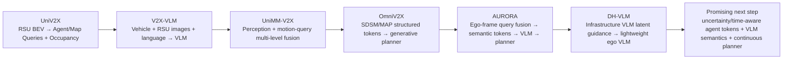
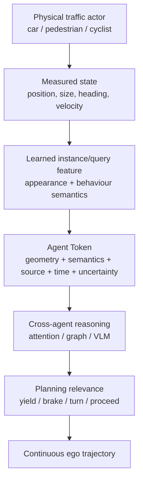
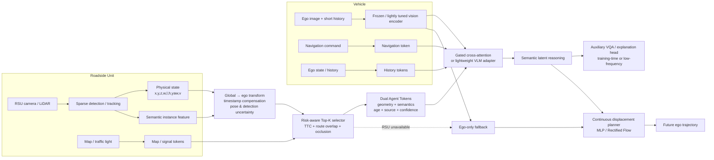

# DAIR-V2X-Based V2X+VLM Trajectory Planning: Research Landscape, Innovation Opportunities, Baselines, Ablations, and Experimental Roadmap

## Executive summary

The research landscape for cooperative end-to-end driving has moved unusually quickly between 2024 and September 2026. For a thesis constrained to **real vehicle–roadside cooperation on DAIR-V2X/V2X-Seq**, the important shift is no longer simply “how do I add a roadside image to a VLM?” The field has already progressed through several increasingly structured interfaces:

UniV2X established planning-oriented sparse query/occupancy communication; UniMM-V2X extended cooperation from perception into motion prediction; V2X-VLM demonstrated direct vision-language cooperative trajectory prediction; OmniV2X replaced model-specific BEV features with **standardised object/map messages and continuous displacement generation**; AURORA now performs **ego-frame roadside-query alignment before VLM reasoning**; and DH-VLM has already explored **latent VLM-to-VLM cooperative guidance**. citeturn9academia25turn17academia26turn29view0 fileciteturn0file0 fileciteturn0file1 fileciteturn0file2

This matters directly to your proposal. Your current planned chain—**roadside sparse Agent/Map Queries → ego-side spatial mapping/visual-prompt reconstruction → VLM semantic reasoning/CoT → autoregressive coordinate tokens**—was a defensible novelty direction when the proposal was written, but parts of it now overlap substantially with AURORA's query-level ego-frame fusion and VLM reasoning, and with OmniV2X's structured roadside tokens and vehicle-side coordinate conversion. fileciteturn0file4 citeturn24academia20turn14view0

I therefore recommend **sharpening the thesis around an agent-centric communication interface rather than around “V2X + VLM” generically**:

> **Recommended research question:** Can a VLM-aware planner use a small set of temporally compensated, uncertainty-aware, ego-frame roadside agent tokens to obtain the safety benefits of V2X while preserving exact geometry, robustness to latency/localisation errors, and low communication bandwidth?

A particularly defensible system would use:

**RSU sparse perception → physical agent states + semantic features → global-to-ego conversion → timestamp/latency compensation → confidence/uncertainty encoding → risk-aware Top-K selection → geometry + semantic agent tokens → lightweight VLM/semantic latent reasoning → continuous displacement planner.**

This is more differentiated from existing work than regenerating a synthetic BEV image and asking the VLM to decode geometry again.

Your immediate research priority, however, should **not** be a more complex model. Your own experiments show that trajectory interpolation, missing `(0,0)` labels, coordinate conventions, future-trajectory validity, traffic-light cases and manoeuvre imbalance can change the measured L2 error dramatically. Your notes record large gains simply from fixing trajectory construction and interpolation, as well as strong outliers at turns and yellow-light scenarios. Until that protocol is frozen, a 0.2–0.5 m apparent gain from a new model could easily be a preprocessing artefact rather than a genuine algorithmic contribution. fileciteturn0file3

For the thesis, I would limit the external baselines to exactly **three**:

| Role | Recommended baseline | What to do |
|---|---|---|
| Strong non-VLM, query-based V2X | **UniMM-V2X** | Use official code and retrain/evaluate under your frozen DAIR-V2X-Seq protocol; do not spend thesis time separately reproducing UniV2X. |
| Strong structured-token foundation planner | **OmniV2X** | Use the public implementation/checkpoints wherever compatible; rerun with your evaluator rather than reimplementing it. |
| Direct cooperative VLM comparator | **V2X-VLM** | Implement a transparent **V2X-VLM-style** reproduction using your existing RoboLLM/V2X pipeline, because its official project page still did not expose released code in the source inspected. |

UniMM-V2X has an official repository, while OmniV2X publicly releases code/model material; V2X-VLM's official project page was still labelled “Code (Coming soon)” in the source available during this research. citeturn13search0turn22search8turn10search6

The strongest potential contributions for a master's thesis, in descending order of my assessment, are: **uncertainty/time-aware Agent Tokens; risk-aware bandwidth allocation; geometry–semantic dual tokens; privileged semantic supervision without expensive text decoding at deployment; continuous displacement rather than absolute-coordinate text generation; temporal agent memory; robust ego-only fallback; and systematic latency/localisation/packet-loss evaluation.** These directions directly target gaps that remain even after OmniV2X, AURORA and DH-VLM rather than duplicating them. citeturn14view0turn24academia20turn29view0

## Current research landscape and what is actually new

A useful way to organise the literature is by **what information crosses the V2X link**. In the last several years, the progression has been roughly:

**dense feature maps → sparse task queries → motion queries → structured physical messages → natural-language/semantic messages → learned latent guidance**.

That progression is more important to your project than the nominal distinction between “BEV”, “VLM” and “foundation model”, because your thesis ultimately needs to decide **what the roadside unit sends, in which coordinate frame, how much information it sends, and how the vehicle converts that message into a future trajectory**.

### Cooperative V2X methods most relevant to DAIR-V2X

| Method | Vehicle / RSU input | Communication and fusion | Backbone / output | Dataset and horizon | Main reported metrics / bandwidth | Open-source status and relevance to you |
|---|---|---|---|---|---|---|
| **UniV2X** | Vehicle and infrastructure camera streams | Roadside **Agent Queries, Lane/Map Queries and occupancy information**; transformed/fused on vehicle side | UniAD-style perception–prediction–planning; ego trajectory | DAIR-V2X sequential planning benchmark | 1/2/3 s results used by later common benchmark implementations; query/occupancy communication ≈ `8.09×10^5 B/s` in the later common table | Public implementation; foundational query baseline, but UniMM-V2X is a stronger descendant for your 3-baseline budget. citeturn9academia25turn25search3 |
| **V2X-VLM** | Vehicle image + infrastructure image + textual/context information | Multimodal VLM fusion; contrastive visual–text alignment and knowledge distillation | Florence-2-family VLM; trajectory generated in language-like representation | DAIR-V2X vehicle–infrastructure data | Reports L2/collision/communication improvements; subsequent unified 1–5 s evaluation places its mean L2 at 2.87 m and collision at 0.26% under that *different* protocol; communication ≈ `1.24×10^7 B/s` | Official project source inspected still says code forthcoming; closest direct VLM baseline, therefore worth a controlled reproduction. citeturn17academia26turn10search6turn29view0 |
| **UniMM-V2X** | Vehicle/RSU cameras | Perception-level **Track, Map, Occupancy queries** plus prediction-level **Motion Queries**; attention fusion; MoE | MoE-BEV encoder + TrackFormer/MapFormer/OccFormer + MotionMoE + planner | DAIR-V2X; 1, 2, 3 s | Avg L2 **1.49 m**, collision **0.12%**, transmission `9.32×10^5 B/s`; versus UniV2X 2.23 m/0.25% in its table | Official code public; very strong non-VLM comparator. fileciteturn0file1 citeturn13search0 |
| **OmniV2X** | Ego front-view images; roadside detected objects; optional map; navigation | No common BEV. RSU transmits SAE-style **SDSM object vectors** and optional MAP tokens; modalities independently tokenised and injected by cross-attention | Frozen DINO-family visual backbone + 130M-parameter Rectified-Flow Transformer; predicts **step-wise displacements** | nuPlan pretraining → **DAIR-V2X-Seq**, 1/2/3 s | **0.86±0.01 m**, **0.06±0.02%** collision, **1,408 B/s** with SDSM; +MAP retains 0.86 m and reduces collision to 0.01%, 25,792 B/s; PDMS also reported | Code/model material public; most important current structured-token baseline. fileciteturn0file2 citeturn14view0turn22search8 |
| **V2X-Graph** | Cooperative vehicle/infrastructure trajectories and scene information | Forecasting-oriented graph representation; cooperative graph-level interaction | Graph-based motion forecasting | **V2X-Seq** and V2X-Traj | ADE/FDE-style motion-prediction metrics | Official code available. Not a planner baseline, but useful for **agent-interaction graph design**. citeturn26academia3turn25search4 |
| **SparseCoop** | Multi-agent sensor streams | Fully sparse **kinematic-grounded instance queries** instead of dense BEV; query aggregation and denoising | Sparse cooperative detector/tracker | **V2X-Seq** and Griffin | Detection/tracking plus communication/latency robustness | Official code supports V2X-Seq-SPD. Particularly valuable for how to construct physically grounded Agent Queries. citeturn11academia49turn13search1 |
| **CoopTrack** | Cooperative sensor observations | Sparse instance-level semantic/motion representations; cross-agent association and aggregation graph | End-to-end cooperative tracking | V2X-Seq and Griffin | Reports mAP/AMOTA, including mAP 39.0 and AMOTA 32.8 in the paper | Useful implementation reference for maintaining **agent identity across views/time** rather than merely concatenating object detections. citeturn26academia1 |
| **RefPtsFusion** | Heterogeneous cooperative sensors/models | Sends compact physical reference points containing object position/velocity/size; selective Top-K fusion | Model-agnostic reference-point fusion | M3CAD | Paper reports reduction from dense communication to only a few kB/s at 5 FPS while retaining cooperative detection quality | Not a DAIR planner, but one of the clearest precedents for your proposed **model-independent Agent Token interface**. citeturn26academia0 |
| **V2X-UniPool** | Multi-source cooperative perception converted to structured language | Time-indexed V2X knowledge pool + retrieval-augmented querying of static/dynamic information | Language/RAG cooperative reasoning | **DAIR-V2X** in the current paper revision | Current revision reports >80% communication reduction while maintaining cooperative utility | Paper reports code availability. Important evidence that language should be treated as a *selective communication representation*, not necessarily as the trajectory decoder. citeturn30view1 |
| **SEAL** | Paired vehicle/roadside visual observations | Scenario-adaptive VLM fusion and contrastive learning; paired weather/long-tail generation | VLM-based V2X reasoning | Cooperative V2X settings | Focus on robustness under snow/fog/long-tail distribution shift | Particularly relevant to paired vehicle–RSU augmentation; not a primary planning baseline. citeturn17academia23 |
| **V2X-QA / V2X-MoE** | Vehicle-only, infrastructure-only and cooperative image views | Explicit view routing and view-specific LoRA/MoE adaptation | Qwen3-VL-family VLM | Built on **V2X-Seq-SPD**; 33,216 QA samples across 12 perception/prediction/reasoning/planning tasks | QA accuracy by task/view; designed to reveal whether cooperative views are actually understood | Official annotations, training/evaluation scripts and adapters are available. Excellent **auxiliary semantic supervision/evaluation** source. citeturn18view1turn17search0 |
| **DH-VLM** | Infrastructure observations + ego observations | Large infrastructure VLM compresses multi-layer reasoning into latent guidance; lightweight vehicle VLM receives it through IDLE adaptation | Qwen2.5-VL-family infrastructure/vehicle models | DAIR-V2X; also V2X-Sim; unified 1–5 s evaluation | Avg L2 **1.87 m**, collision **0.19%** in its 1–5 s table; `3.45×10^5 B/s` reported | Very important frontier reference: **“latent VLM communication” by itself is no longer an untouched novelty claim**. citeturn29view0 |
| **AURORA / V2XBench** | Ego and RSU cameras, maps/detections; simulated closed loop | RSU spatial detection/map queries are explicitly transformed into ego coordinates, associated and fused by **CQAF**; resulting semantic tokens enter a LoRA VLM | Dual-view query encoder + LoRA VLM + waypoint token + VAE generative planner | **V2XBench**, CARLA simulation rather than DAIR; open- and closed-loop | **Driving Score 76.02**, **Route Completion 98.21%**, open-loop L2 1.60 m, communication `4.84×10^6 B/s` | No official public implementation was identified in the primary source search. Its method strongly overlaps your original “cross-view query → semantic/VLM” concept. fileciteturn0file0 citeturn24academia20 |
| **CoDriving / V2Xverse** | Ego + collaborating agents in CARLA | Driving-oriented collaborative communication optimised for end-to-end behaviour | Cooperative end-to-end driving network | V2Xverse simulation, closed loop | Driving/safety/route metrics and communication | Public project/code; useful optional closed-loop simulator, not a replacement for your DAIR benchmark. citeturn1academia33turn1search11 |

Two conclusions emerge from this table.

First, **a generic “send sparse queries to the vehicle” contribution is no longer sufficient**. UniV2X, UniMM-V2X, SparseCoop and AURORA all communicate or fuse sparse instance/query representations in different ways. citeturn13search0turn11academia49turn24academia20

Second, **a generic “convert V2X information into semantic/VLM tokens” claim is also becoming crowded**. V2X-VLM performs visual-language cooperative prediction; V2X-UniPool converts V2X content into structured language; DH-VLM sends latent semantic guidance; AURORA fuses spatial queries into VLM-compatible semantic tokens; OmniV2X treats physical V2X messages as independent context tokens. citeturn17academia26turn30view1turn29view0turn24academia20turn14view0

The remaining opportunity lies in **what those tokens explicitly know about physical state, time, confidence and causality**, and how the planner maintains geometry while exploiting VLM semantics.

### Single-agent work that should influence the design, but not be used as your main baseline

Because your hard requirement is **vehicle + roadside**, nuScenes-only or ego-only systems should not occupy one of your 2–3 principal baseline slots. They remain valuable architectural references.

| Method | Relevant idea for your project | Why it matters |
|---|---|---|
| **UniAD** | Shared query interfaces connect tracking, mapping, motion prediction and planning | Established the interpretation of sparse object/track queries as a planning-oriented interface rather than just detector features. citeturn12academia12turn12search0 |
| **SparseDrive** | Fully sparse scene representation and multimodal planning | Evidence that dense BEV is not required for strong perception-to-planning pipelines. citeturn12academia13 |
| **MotionLM** | Quantises participant motion into discrete motion tokens and autoregressively models joint futures | Useful conceptual reference if you represent *other-agent motion hypotheses* as tokens, although I would not copy its discrete ego-trajectory formulation directly. citeturn11academia48 |
| **SMART** | Tokenises vectorised maps and agent trajectories into a decoder-only motion model | Supports the broader idea that object/map structure can be a more natural sequence-model interface than pixels. citeturn11academia51 |
| **Driving with LLMs** | Encodes object-level vector information for LLM reasoning | Direct precedent for preserving object-level numeric structure when interfacing with language models. citeturn3academia0 |
| **DriveVLM** | Hierarchical VLM reasoning coupled to a conventional planner; fast/slow dual system | Important lesson: the VLM does not have to numerically generate every waypoint itself. citeturn4academia48 |
| **Senna** | Uses an LVLM for high-level decision information while a specialised driving system handles precise trajectory generation | Supports decoupling semantic reasoning from metric trajectory prediction. citeturn3academia1 |
| **ORION** | Temporal query representations, language reasoning and a generative planner | A useful recent template for coupling temporal scene understanding to continuous action generation. citeturn4academia49 |

### Do not construct a leaderboard from numbers copied across papers

This point is critical for your thesis.

OmniV2X evaluates the common cooperative benchmark at **1, 2 and 3 seconds**, reporting UniMM-V2X at 1.49 m average L2 and OmniV2X at 0.86 m. DH-VLM later evaluates methods at **1–5 seconds** and reports, for example, UniMM-V2X at 2.60 m and V2X-VLM at 2.87 m under its recalculated protocol. These are not contradictory results; they are different horizons/evaluation pipelines. citeturn14view0turn29view0

Your current internal experiment evaluates points every 0.5 s out to 4.5 s and has undergone several changes to trajectory interpolation and filtering. Those values therefore cannot yet be placed beside the 1/2/3 s OmniV2X or UniMM-V2X results and interpreted as superiority. fileciteturn0file3

Your thesis should define one **primary common protocol** and rerun every implemented method through it:

\[
\text{same split}+\text{same trajectory GT}+\text{same timestamps}+
\text{same coordinate convention}+\text{same horizons}+
\text{same collision checker}.
\]

I recommend **1/2/3 s as the primary published-compatible protocol**, with an optional extended 4/5 s analysis because long horizons reveal semantic/intent errors more clearly. This gives you direct compatibility with UniMM-V2X and OmniV2X while still allowing a long-horizon robustness study. fileciteturn0file1 fileciteturn0file2

## What an “agent” actually means in autonomous driving

The word **agent** is overloaded in this area. Clarifying it will help you design your model and write the thesis correctly.

**A physical traffic agent** is a dynamic participant in the scene: a vehicle, pedestrian, cyclist and sometimes the ego vehicle itself. It has a physical state such as position, orientation, dimensions, velocity and potentially acceleration or an estimated future trajectory.

**A cooperative V2X agent** means a sensing/computing node participating in collaboration. A connected vehicle is an agent, but an RSU can also be treated as an agent despite being stationary because it observes the environment, computes representations and communicates them to other nodes. Cooperative-perception papers use “multi-agent” in precisely this system-level sense. citeturn11academia49turn26academia1

**An Agent Query/Object Query/Track Query** is different again. It is a learned neural representation corresponding, approximately, to one physical scene instance. It is usually composed of a trainable or propagated content embedding plus some spatial reference point/anchor. DETR3D, for example, uses sparse 3D object queries whose reference points are projected into multiple camera views to sample relevant image features. citeturn11academia50

UniAD made this interface particularly important for end-to-end driving: tracking queries are not discarded after detection but become structured instance representations consumed by later prediction/planning components. citeturn12academia12

UniV2X extends that logic across V2X communication. In its design, dynamic-object Agent Queries and lane/map information become communicable sparse representations rather than transmitting an entire dense BEV tensor. UniMM-V2X pushes the idea further by also sharing **Motion Queries**, so cooperation exists at both perception and prediction levels. fileciteturn0file1

SparseCoop makes the connection between a learned query and the physical actor even more explicit through **kinematic-grounded instance queries**, adding physical object state to an otherwise latent representation. That is especially relevant to your project because it reduces the risk that a VLM receives an opaque feature vector whose geometric meaning has been lost. citeturn11academia49

AURORA provides perhaps the closest existing mechanism to the spatial part of your proposal. Its RSU produces detection/map spatial queries; the roadside detection-query reference points are transformed into the **ego coordinate frame**, spatially matched to ego queries and fused with a gated residual operation. Unmatched roadside queries can be appended to preserve objects hidden from the ego view. The fused spatial representation then refines semantic tokens used by the VLM. fileciteturn0file0

OmniV2X takes a different stance. Its roadside object is not principally a learned Agent Query. It is a physically interpretable SDSM-like state:

\[
v_i=
[x,y,z,l,w,h,\sin\theta,\cos\theta,v_x,v_y,
c_\text{veh},c_\text{ped},c_\text{cyc}].
\]

The RSU object state is expressed globally, then transformed on the ego vehicle into its local frame using localisation information, and a lightweight Transformer converts these object vectors into planner context tokens. citeturn14view0

That distinction suggests an important design choice for you:

> **Do not force yourself to choose between “physical object state” and “learned Agent Query”. Make the Agent Token contain both.**

A practical representation could be

\[
q_i =
[
h_i^{sem};
\phi(p_i^{ego},d_i,\sin\psi_i,\cos\psi_i,v_i);
e_{\text{class}};
e_{\text{source}};
e_{\Delta t};
e_{\text{visibility}};
e_{\text{uncertainty}}
],
\]

where \(h_i^{sem}\) is a learned semantic feature; \(p_i^{ego}\) is the deterministic ego-frame position; \(d_i\) contains physical dimensions; \(\Delta t\) is message age; and uncertainty can encode detection confidence and localisation covariance.

The deterministic part should be transformed before the VLM sees it:

\[
p_i^{ego}(t)
=
T_{\text{global}\rightarrow\text{ego}(t)}
\left[
p_i^{global}(t-\Delta t)
+
v_i^{global}\Delta t
\right],
\]

with an analogous orientation transformation.

This is precisely where your existing debugging work becomes scientifically useful rather than merely engineering overhead. Your project notes already show that misunderstanding frame definitions or treating invalid trajectories as legitimate zeros can catastrophically distort predicted motion. fileciteturn0file3

A fourth meaning of “agent” appears in the LLM world: an **LLM/VLM agent** is a goal-directed software system with reasoning, memory and sometimes tool use. That is conceptually separate from a traffic Agent Query. I would avoid calling your learned traffic representation a “VLM agent” unless you genuinely build an autonomous reasoning agent. Otherwise, use **traffic agent**, **cooperative node**, **agent query**, and **agent token** consistently.

A useful conceptual stack for your thesis is therefore:

This representation is more defensible scientifically than treating an arbitrary roadside visual feature as an “agent”.

## Ranked innovation opportunities for your project

The ranking below is my assessment of **novelty relative to the September 2026 literature**, expected effect on planning, and implementation risk. “Novelty” is not a claim that no paper has ever used the ingredient individually; it assesses whether the *specific formulation for DAIR-V2X cooperative VLM planning* remains sufficiently differentiated from UniMM-V2X, OmniV2X, AURORA, DH-VLM and related work. citeturn14view0turn24academia20turn29view0

| Rank / direction | Novelty | Expected impact | Difficulty | Why it is worth doing | Required experiment | Main metric expected to move | Principal risk |
|---|---|---|---|---|---|---|---|
| **Uncertainty- and time-aware ego-frame Agent Tokens** | High | High | Medium | Existing methods transform/fuse agents, but a token explicitly coupling physical state, message age, localisation uncertainty and detection confidence is a strong practical V2X interface. It directly attacks DAIR synchronisation/localisation imperfections. | Compare raw RSU coordinates → deterministic ego conversion → + velocity latency compensation → + age embedding → + uncertainty embedding. Inject pose/time noise. | Collision, long-horizon L2/FDE, robustness degradation at 100–500 ms latency, calibration | DAIR may not provide ground-truth uncertainty distributions; confidence may be poorly calibrated. |
| **Risk-aware Top-K V2X communication** | High | High | Medium | Most compression answers “how many tokens”; yours can answer **which agents matter to ego planning**. Rank by route intersection, TTC, occlusion, motion intent and confidence. | K=4/8/16/32/all; confidence-only vs nearest-distance vs TTC vs learned risk scorer. Plot error/collision against bytes/s. | Collision–bandwidth Pareto frontier; BPS; occluded-subset L2 | A faulty selector could drop the one rare critical pedestrian/vehicle. Must include conservative fallback. |
| **Geometry–semantic dual representation per traffic agent** | High | High | Medium–High | VLM semantics are useful, but replacing exact coordinates with language loses metric fidelity. Maintain a continuous geometry token alongside learned semantic context and fuse only at the planner/VLM boundary. | Geometry-only; semantic-only; concatenated; gated dual-stream; shuffle semantic features as control. | Collision and L2 together; semantic QA; bandwidth | One modality may dominate training; semantic encoder may add compute without measurable planning gain. |
| **Privileged semantic supervision but latent reasoning at inference** | High | High | Medium–High | Your proposal currently favours explicit CoT. AURORA shows VQA supervision can improve closed-loop performance even when open-loop L2 slightly worsens, while DH-VLM suggests latent semantic guidance. Train reasoning, but do not require expensive word-by-word CoT during safety-critical inference. | No language loss vs VQA/scene-description auxiliary loss vs explicit CoT decoding vs latent-only deployment. | Collision/DS or PDMS, semantic QA accuracy, latency, memory | Synthetic reasoning supervision can introduce label noise or plausible-but-wrong explanations. |
| **Continuous displacement generation instead of absolute coordinate text** | Medium | High | Medium | This directly addresses one of your largest current failure modes. OmniV2X reports absolute waypoints under identical settings to be substantially worse than displacement generation because of route/location shortcut learning. | Absolute `(x,y)` text tokens vs delta `(Δx,Δy)` text vs continuous delta MLP vs Rectified Flow. | L2/FDE, smoothness, collision, invalid-output rate | Improvements can be partly due representation/preprocessing rather than VLM intelligence; control all other variables. |
| **View-specialised adapters/MoE with graceful ego-only fallback** | Medium–High | High | Medium | V2X-QA shows that simply giving a VLM an extra cooperative image does not guarantee cross-view reasoning. Use view-specialised LoRA/adapters for ego, RSU and cooperative fusion, and train random RSU dropout. | Shared adapter vs ego/RSU-specific LoRA vs MoE routing; evaluate 0%, 30%, 70%, 100% RSU availability. | Cooperative gain, ego-only degradation, collision under packet loss | Small DAIR training set can cause specialist overfitting. |
| **Temporal Agent Memory and stale-message reasoning** | Medium–High | High | Medium | Static per-frame fusion ignores that a message received now may describe an object observed 100–300 ms ago. Maintain agent identities, historical motion and token age. CoopTrack and sequential DAIR data make this implementable. | 1-frame vs 2/4/8-frame memory; with/without track ID; stale-message perturbation. | Turn/intersection FDE, collision, stability under latency | Track association mistakes may be worse than discarding history. |
| **Ego-to-V2X staged pretraining** | Medium | High | High | OmniV2X demonstrates a major data-efficiency advantage from learning driving priors before V2X adaptation. You can test whether semantic/agent-token adaptation also benefits from staged training. | Scratch vs vehicle-only pretraining → cooperative fine-tuning; 1/5/10/25/100% V2X-data curves; optionally V2X-QA pretraining before trajectory tuning. | Sample efficiency, L2, PDMS/collision | Compute and domain mismatch; copying Omni's pretraining alone is not novel, so couple it to your new Agent Token interface. |
| **Paired cross-view augmentation and V2X corruption curriculum** | Medium | Medium–High | Medium | Vehicle/roadside augmentation must preserve cross-view correspondence. SEAL provides evidence for paired scenario/weather augmentation; add packet loss, object dropout and localisation noise. | Normal training vs paired weather/visibility augmentation vs communication corruption curriculum. | Long-tail collision, robustness slope, worst-case L2 | Synthetic appearance shift can make training less realistic or break geometry if applied inconsistently. |
| **Counterfactual agent relevance and reasoning–action consistency** | High | Medium–High | High | A VLM explanation is not useful if it is disconnected from its trajectory. Remove/mask candidate agent tokens and measure whether the planned action changes in the expected direction. | Mask highest-risk vs random vs irrelevant agent; compare explanation risk ranking with planning sensitivity; optional auxiliary causal ranking loss. | Causal consistency, collision on critical subsets, explanation faithfulness | No universally accepted benchmark metric; requires careful evaluation design. |

### The combination I would make the thesis core

Trying to implement all ten as equal “innovations” would weaken the thesis. I would make **three architectural contributions and two evaluation contributions** central:

**Core architecture:**  
**Agent Tokenisation → Risk-Aware Communication → Semantic/Continuous Hybrid Planner**

**Robustness contribution:**  
**Time/latency/localisation uncertainty**

**Training contribution:**  
**Privileged semantic supervision + V2X dropout**

A concrete architecture would be:

This differs from AURORA because roadside information is not merely a learned spatial query aligned and merged with ego query features; the interface explicitly exposes **message age, uncertainty and risk-conditioned communication**. It differs from OmniV2X because semantic reasoning remains available instead of using only physical condition tokens, while your novelty is not simply “SDSM tokens + flow”. It differs from DH-VLM because you preserve explicit object geometry and do not rely principally on a large infrastructure VLM transmitting a learned latent. citeturn24academia20turn14view0turn29view0

### What I would demote from the current proposal

Your proposal places considerable weight on **reconstructing roadside sparse queries into visual prompt symbols on an ego BEV image** before the VLM. fileciteturn0file4

I would make this an **ablation rather than the mandatory main route**.

There are three reasons. First, OmniV2X shows that structured roadside objects can be consumed directly without reconstructing a dense BEV. citeturn14view0 Second, AURORA shows that query-level ego-frame alignment can feed semantic tokens to the VLM without requiring visual re-rendering. fileciteturn0file0 Third, turning an exact physical vector back into pixels can introduce quantisation, rasterisation and occlusion ambiguity—after which the VLM has to infer geometry that you already knew numerically.

That visual reconstruction still makes an excellent scientific experiment:

> **Does explicit visual grounding help a VLM understand a cooperative object better than an equivalent structured Agent Token?**

Compare:

\[
\text{Agent Token}
\quad \text{vs}\quad
\text{BEV visual prompt}
\quad \text{vs}\quad
\text{Agent Token + BEV prompt}.
\]

If the BEV prompt wins, you retain it with evidence. If it does not, you have avoided making a visually attractive but technically unnecessary block the centre of the thesis.

## Baselines, ablations, and a fair evaluation protocol

### The three baselines I recommend

| Baseline | Why it is necessary | Implementation recommendation | What not to do |
|---|---|---|---|
| **UniMM-V2X** | Represents the strongest directly relevant **query/BEV multi-level cooperative** paradigm on DAIR among the methods you already study. It shares Track/Map/Occupancy and Motion Queries, making it an ideal contrast to your Agent Token + VLM approach. | **Use official code and retrain/evaluate** on the exact split/protocol you freeze. The public repository provides DAIR/V2X-Seq-SPD preparation and training/evaluation code. The current README source inspected did not expose an unambiguous ready-to-use released checkpoint, so plan on training unless the authors' release has since added one. citeturn13search0 | Do not separately make UniV2X a fourth main baseline. UniMM-V2X already directly compares to it and extends the same family. fileciteturn0file1 |
| **OmniV2X** | The hardest competitor for your proposed structured-token planner: real DAIR-V2X-Seq, extremely low communication, object/map tokens, ego-side coordinate conversion and continuous displacement generation. | **Use the released implementation/checkpoint/evaluation resources** rather than reimplementing. Then rerun through your frozen evaluator wherever technically possible. Its public release includes DAIR evaluation/fine-tuning material. citeturn22search8 | Do not compare your 0.5–4.5 s internal metric directly to its published 1/2/3 s average. citeturn14view0 |
| **V2X-VLM** | Directly answers whether your contribution is better than simply giving the VLM vehicle + roadside visual/language context. It is the conceptually closest **V2X+VLM** comparator. | Because the official project page source still lists code as forthcoming, build a **clearly labelled V2X-VLM-style reproduction** within your existing RoboLLM pipeline: vehicle image + RSU image/context → same VLM backbone/fine-tuning strategy available to your method → same trajectory decoder/evaluator. citeturn10search6turn17academia26 | Do not claim your reproduction is an exact reproduction unless all preprocessing, prompt, backbone and training settings match the paper. Report it transparently as a reimplementation. |

AURORA is **not** one of my three baselines because its published results are on the new simulated V2XBench rather than your mandatory DAIR-V2X benchmark. It is nevertheless one of the most important *methodological competitors* and should be discussed extensively in related work. citeturn24academia20

DH-VLM is similarly better treated as a 2026 frontier reference unless a stable official implementation becomes available and you decide to replace the V2X-VLM reproduction with it. Its infrastructure-to-vehicle latent VLM communication means you cannot claim “semantic latent V2X communication” by itself as novel. citeturn29view0

### Recommended ablation matrix

Do **not** run a full Cartesian product of every choice. Use a staged matrix so each experiment answers one question.

| ID | Change from reference model | Scientific question | Expected outcome / hypothesis |
|---|---|---|---|
| **A0** | Ego image/history only | How strong is the vehicle-only prior? | Establishes the minimum. V2X gain must be measured relative to this rather than only against other papers. |
| **A1** | + raw RSU image | Does another image alone provide useful cooperation? | Some gain in visible/occluded cases, but relatively high bandwidth and weak explicit geometry. |
| **A2** | + physical Agent Tokens only | Is structured roadside geometry sufficient? | Strong safety/bandwidth gain, especially at occluded intersections. |
| **A3** | + semantic agent features only | Can semantic features replace physical geometry? | Likely improves high-level understanding but may lose metric accuracy. |
| **A4** | + geometry + semantic dual Agent Tokens | Does preserving both representations give complementary value? | **Expected principal model**; target is lower collision than A2 without sacrificing L2. |
| **A5** | A4 + map/traffic-light tokens | How much do static topology and signal state matter? | Largest effect on intersections, turns and signal-controlled cases; OmniV2X's MAP result suggests a potential safety gain. citeturn14view0 |
| **A6** | global coordinates vs ego transform | Can the VLM learn coordinate relationships implicitly? | Deterministic ego-frame transform should be substantially more stable, particularly for turns. |
| **A7** | A6 + timestamp/velocity compensation | Does stale V2X information explain residual error? | Lower error under artificial delay; modest effect in low-dynamic scenes. |
| **A8** | + uncertainty/confidence/message-age embeddings | Can the planner learn when *not* to trust the RSU? | Small clean-data gain but larger robustness gain under pose/detection noise. |
| **A9** | Top-K = 4/8/16/32/all | How much communication is actually needed? | Expect a saturation curve; the scientifically valuable result is the Pareto frontier rather than one “best K”. |
| **A10** | nearest/confidence selection vs TTC/route-risk vs learned risk | Is planning-aware communication better than generic compression? | Risk-based selection should improve collision at equal bandwidth if designed correctly. |
| **A11** | no semantic loss vs VQA/scene-description auxiliary supervision | Does language supervision improve planning rather than merely explanations? | Potentially better safety/long-tail reasoning even if average L2 moves little; AURORA observed this open-loop/closed-loop trade-off. fileciteturn0file0 |
| **A12** | explicit text CoT at inference vs latent reasoning | Is word-generation latency actually necessary? | Latent version should retain much of semantic gain with lower latency; must verify rather than assume. |
| **A13** | absolute XY text vs ΔXY text vs continuous ΔXY MLP | Is the trajectory representation itself limiting performance? | Delta representation should reduce coordinate memorisation and invalid sequences. |
| **A14** | continuous MLP vs Rectified Flow | Is generative multimodality useful on DAIR? | Flow may improve longer-horizon/safety metrics at higher implementation cost; OmniV2X is strong evidence but not proof for your architecture. citeturn14view0 |
| **A15** | current frame vs 2/4-frame agent memory | Does temporal Agent Memory help intent inference? | Most useful at intersections and for turning/crossing agents. |
| **A16** | no RSU dropout vs random communication dropout during training | Can the system degrade gracefully? | Target: preserve ego-only performance when communication disappears. |
| **A17** | scratch vs ego-only pretrain → V2X fine-tune | Does the representation reduce V2X sample complexity? | Expect strongest improvement at 1–10% DAIR fine-tuning data; OmniV2X demonstrated this trend for its architecture. citeturn14view0 |
| **A18** | visual-prompt reconstruction instead of Agent Tokens | Is your original BEV visual reconstruction genuinely useful? | This should be treated as an empirical question, not assumed to be superior. |
| **A19** | Agent Tokens + visual prompt | Are numeric geometry and visual grounding complementary? | If it beats A4/A18 consistently, this can rescue the original visual-reconstruction contribution with stronger evidence. |

For a master's thesis, the **minimum defensible core** is A0, A1, A2, A4, A6–A10, A11, A13 and the robustness sweeps below. The rest can be added based on time.

### Robustness matrix

Your proposed contribution becomes substantially more convincing if it is evaluated under communication conditions rather than only clean DAIR frames.

| Stress factor | Suggested levels | What it tests |
|---|---|---|
| V2X latency | 0 / 100 / 300 / 500 ms | Value of time compensation and temporal Agent Memory |
| Object dropout | 0 / 10 / 30 / 50% | Communication/perception loss tolerance |
| Translation error | 0 / 0.1 / 0.5 / 1.0 m | Sensitivity to ego/RSU localisation |
| Yaw error | 0 / 0.01 / 0.05 / 0.1 rad | Cross-frame rotation sensitivity |
| Detection position noise | 0 / 0.2 / 0.5 / 1.0 m | Reliance on exact roadside detection |
| RSU availability | 100 / 70 / 30 / 0% | Graceful fallback |
| Token budget | 4 / 8 / 16 / 32 / all agents | Communication–performance curve |

OmniV2X already evaluates localisation perturbations, 500 ms delay, object dropout and detection error, so your robustness analysis needs to be at least as systematic if you intend to claim better practical deployability. Its paper reports only small degradation at 500 ms injected latency and under 30% object dropout plus 0.5 m detection error in its own setting. fileciteturn0file2

### Metrics I would report

For the primary DAIR benchmark:

\[
\textbf{Planning accuracy:}
\quad L2@1s,\; L2@2s,\; L2@3s,\;
\text{Final L2/FDE}.
\]

\[
\textbf{Safety:}
\quad \text{Collision Rate},\;
\text{Off-road/Drivable-Area Violation}.
\]

\[
\textbf{Deployability:}
\quad \text{Bytes/s},\;
\text{latency},\;
\text{GPU memory},\;
\text{trainable parameters}.
\]

\[
\textbf{Trajectory quality:}
\quad \text{jerk/acceleration or comfort metric}.
\]

Where feasible, add **PDMS** following OmniV2X's adaptation, but make clear that this is a predictive/kinematic closed-loop proxy rather than true interactive closed-loop DAIR driving. citeturn14view0

The most interesting reporting format is not a single mean. Stratify results by:

**straight / left / right**,  
**traffic-light / non-signal**,  
**high-occlusion / low-occlusion**,  
**near / far critical agent**,  
**ego-only-visible / RSU-only-visible / visible-to-both**.

Your own data already appear imbalanced toward straight-driving examples and contain disproportionate error in turns/yellow-light cases, so a single mean can hide the exact failure modes your method is supposed to solve. fileciteturn0file3

Finally, report **mean ± standard deviation over several seeds or bootstrap confidence intervals** for the final model and principal baselines. OmniV2X already reports repeated-seed statistics, raising the standard for claims based on small differences. citeturn14view0

## DAIR-V2X data strategy and comparable vehicle–roadside datasets

DAIR-V2X remains the correct primary choice for your thesis because it is a real-world **vehicle–infrastructure** dataset rather than an ego-only autonomous-driving corpus. The original DAIR-V2X release contains synchronised vehicle/infrastructure sensing and more than 71,000 camera and LiDAR frames in its cooperative perception benchmark. V2X-Seq extends this family toward sequential tasks, with sequential perception sequences and cooperative trajectory-forecasting resources collected across 28 intersections. citeturn25academia13turn25academia12

The official V2X-Seq repository exposes sequence data processing and baselines, making **V2X-Seq-SPD / the UniV2X-family planning split** the most natural version for your project rather than treating arbitrary DAIR frame pairs as an independent dataset construction. citeturn25search0turn25search1

### Dataset comparison

| Dataset / platform | Real or simulated | True vehicle + roadside? | Sensors / distinctive feature | Trajectory/planning suitability | Recommended role in your thesis |
|---|---|---:|---|---|---|
| **DAIR-V2X / V2X-Seq-SPD** | Real, China | **Yes** | Vehicle + infrastructure cameras/LiDAR; calibration; sequential scenes; maps/traffic information in sequential extension | **High**; directly used by UniV2X, UniMM-V2X, OmniV2X-family planning research | **Primary training, validation and baseline benchmark.** citeturn25academia13turn25academia12turn25search0 |
| **V2X-QA** | Real-data annotation layer on V2X-Seq | **Yes** | View-decoupled vehicle/infrastructure/cooperative QA; 33,216 samples, 12 task categories | High for semantic supervision, not a standalone metric-trajectory dataset | **Auxiliary semantic pretraining and cross-view reasoning evaluation.** citeturn18view1turn17search0 |
| **TUMTraf-V2X** | Real, Germany | **Yes** | Five roadside and four onboard sensing units; camera/LiDAR, track IDs, GPS/IMU; challenging manoeuvres | Medium for planning; strongest as perception/association generalisation | **External test of Agent Token extraction and cross-country domain generalisation.** citeturn19academia1turn20academia26 |
| **V2X-Real** | Real | **Yes** | Two vehicles plus two smart-infrastructure nodes; LiDAR and multi-view cameras; >1.2M boxes | Primarily cooperative perception rather than end-to-end ego planning | **External token/perception robustness**, not primary planner training. citeturn19academia0turn20academia25 |
| **HoloVIC** | Real | **Yes**, infrastructure-rich | 100k+ synchronous frames; multiple camera/LiDAR/fisheye layouts; cross-device/consecutive track IDs | Particularly strong for association and large-coverage infrastructure perception; less direct for ego trajectory planning | **Cross-view Agent identity / association study.** citeturn20academia23turn20search2 |
| **UrbanIng-V2X** | Real, Germany | **Yes** | Three urban intersections; two vehicles and up to three infrastructure poles; vehicle RGB/LiDAR, roadside thermal/LiDAR; HD map/digital twin | Medium; useful for domain shift and map-conditioned cooperative representations | **Optional external generalisation dataset**, especially if your token interface is sensor/model independent. citeturn19academia3turn25academia15 |
| **V2XBench** | CARLA simulation | **Yes** | Synchronous ego–RSU RGB/depth/LiDAR; 38 safety-critical scenarios; Chat-V2XBench VQA; closed-loop control | **Very high for closed-loop VLM evaluation**, but distribution differs from DAIR | **Best optional second-stage closed-loop validation** if resources permit. fileciteturn0file0 citeturn24academia20 |
| **V2Xverse** | CARLA simulation | Cooperative multi-agent | Closed-loop collaborative-driving simulator | High for interactive cooperative driving | Optional closed-loop robustness/generalisation test. citeturn1academia33turn1search11 |
| **V2X E2E Simulator** | Simulation / ROS2–Autoware ecosystem | Supports roadside cooperation | Network-delay/noise and roadside cooperative perception integration | Useful for systems/deployment experiments rather than a canonical learning benchmark | Optional test bed if thesis time extends to communication-network effects. citeturn17search5 |

This dataset landscape reinforces your earlier instinct that **nuScenes should not be the main experimental dataset or principal cooperative baseline**, because it does not provide the required simultaneously operating road-infrastructure collaborator. Ego-only datasets can still be useful for **pretraining a driving prior**, as OmniV2X does with nuPlan before adapting to DAIR-V2X-Seq, but they do not validate V2I cooperation. citeturn14view0

For your thesis I would use a three-tier data plan:

**Primary:** DAIR-V2X-Seq/SPD for every headline result.

**Auxiliary semantics:** V2X-QA on the same data family, which avoids introducing a major geographic/sensor domain mismatch. citeturn18view1

**External validation:** either TUMTraf-V2X or UrbanIng-V2X, but only for the **front-end Agent Token representation/robustness**, unless you can construct a defensible trajectory target. Do not fabricate pseudo-planning labels merely to claim a second dataset result.

If you have enough time for one simulator, I would select **V2XBench rather than another perception-only dataset**, because the most important unresolved question in current V2X+VLM work is whether lower open-loop L2 really translates into safer interactive behaviour. AURORA provides an especially instructive result: its open-loop L2 is not the best among its baselines, but its closed-loop Driving Score is substantially better. fileciteturn0file0

## Prioritised experimental roadmap and To-Do checklist

The main technical risk in your project is currently **benchmark validity**, not lack of model novelty. Your progress notes document several trajectory-generation regimes, coordinate corrections, interpolation schemes and filtering decisions, with large changes in L2. You also found invalid zero-heavy trajectories, implausible extrapolations and outlier failures clustered around particular manoeuvres and signals. fileciteturn0file3

That means the order of work should be:

\[
\boxed{\text{Benchmark correctness}}
\rightarrow
\boxed{\text{Baseline reproducibility}}
\rightarrow
\boxed{\text{Agent interface}}
\rightarrow
\boxed{\text{VLM semantics}}
\rightarrow
\boxed{\text{robustness and bandwidth}}
\]

—not the other way around.

### To-Do table

| Priority | Task | Deliverable / pass criterion | Effort | Main resources |
|---|---|---|---|---|
| **P0** | Freeze the exact DAIR version and split | One manifest listing every train/val/test sequence/token; preferably UniV2X/UniMM/Omni-compatible V2X-Seq-SPD split | Medium | Dataset, CPU/storage |
| **P0** | Freeze coordinate definitions | Document global, vehicle/LiDAR, camera and RSU axes; unit tests for transformation matrices | Medium | Python/NumPy; calibration files |
| **P0** | Build geometric unit tests | Synthetic point/object transformed RSU→global→ego must recover expected coordinates; visualise 20–50 real samples | Medium | CPU, plotting |
| **P0** | Repair trajectory GT generation | Never treat missing future states as `(0,0)` observations; preserve a validity mask; explicitly document interpolation/extrapolation | **High** | Existing preprocessing code |
| **P0** | Audit interpolation policy | Compare discard-invalid, linear interpolation, velocity-based extrapolation and masked loss; report data-retention rate | Medium | CPU |
| **P0** | Freeze evaluation horizons | Primary 1/2/3 s evaluator; optional 4/5 s extension; identical for all models | Low | Evaluation code |
| **P0** | Implement one canonical collision evaluator | Verify coordinate frame, ego box, agent boxes and time indexing with hand-checked examples | Medium | CPU |
| **P0** | Establish internal ego-only baseline | Vehicle-only input, same trajectory decoder/evaluator as your future model | Medium | 1 GPU |
| **P0** | Run manoeuvre/data statistics | Straight/left/right, traffic lights, occlusion, missing trajectory ratio, speed distribution | Low | CPU |
| **P0** | Reproduce/evaluate OmniV2X | First reproduce published-style evaluation; then run through your evaluator | Low–Medium | Public code/checkpoints; ≥1 modern GPU |
| **P0** | Set up UniMM-V2X | Verify data converter and official evaluation; retrain only after the data manifest is frozen | High | Multi-GPU preferable; paper training used 8 A800 GPUs. fileciteturn0file1 |
| **P0** | Build V2X-VLM-style baseline | Vehicle+RSU images/context using your current RoboLLM infrastructure; transparent reimplementation | Medium–High | VLM fine-tuning GPU(s) |
| **P1** | Build deterministic RSU→ego Agent State pipeline | For every roadside object produce ego-frame state, source ID, timestamp and validity flag | Medium | DAIR calibration + detector/GT objects |
| **P1** | Add Agent Token encoder | MLP/Transformer encoder over physical state + semantic feature + class/confidence/source | Medium | 1 GPU |
| **P1** | Add time compensation | Propagate object state using velocity to ego time; encode message age explicitly | Medium | Preprocessing/model |
| **P1** | Add uncertainty fields | Detection confidence; simulated pose/noise scale; optional learned uncertainty head | Medium | 1 GPU |
| **P1** | Implement Top-K selection | Distance, confidence, TTC/route-intersection and learned-risk variants | Medium | Mostly CPU + 1 GPU |
| **P1** | Implement dual geometry/semantic fusion | Separate continuous geometry and semantic embeddings with gated cross-attention | Medium–High | 1–2 GPUs |
| **P1** | Add V2X-QA/scene semantic auxiliary supervision | Train semantic latent without making text decoding mandatory at deployment | Medium | V2X-QA + VLM/LoRA GPU |
| **P1** | Replace absolute coordinate output | Run absolute XY vs delta XY; then add continuous MLP and, if justified, Rectified Flow | Medium–High | 1 GPU |
| **P1** | Run core ablations | A0/A1/A2/A4/A6–A11/A13 | High overall | Repeated GPU training |
| **P1** | Run communication sweep | K=4/8/16/32/all and compute real serialised B/s | Medium | Evaluation runs |
| **P1** | Run robustness sweep | Delay, object dropout, pose error, yaw error, detector noise, RSU outage | Medium | Mostly inference |
| **P1** | Perform failure-case analysis | Top 20 L2/collision failures with images, critical-agent tokens, predicted/GT trajectory, explanation | Medium | Visualisation tools |
| **P2** | Add temporal agent memory | Track/aggregate 2–4 previous steps with message-age-aware attention | Medium–High | GPU + tracking data |
| **P2** | Staged pretraining experiment | Vehicle-only pretrain → 1/5/10/25/100% cooperative fine-tuning | High | Significant GPU time |
| **P2** | Cross-domain Agent Token evaluation | TUMTraf-V2X or UrbanIng-V2X; test token extraction and geometric robustness | High | New dataset/download/preprocess |
| **P2** | Optional V2XBench closed loop | Port interface into CARLA/V2XBench and compare ego-only/cooperative safety | **High** | Simulator, multi-GPU potentially |
| **P2** | Statistical final runs | ≥3 seeds for main model/major baselines; bootstrap confidence intervals for test metrics | Medium–High | Repeated inference/training |
| **P2** | Thesis-system metrics | Measure end-to-end latency, GPU memory, trainable parameters, true encoded communication size | Low–Medium | Target GPU + profiler |

### Compute planning

A major advantage of the recommended Agent Token direction is that the **new contribution itself does not require training a giant model from scratch**. A frozen or lightly tuned vision encoder, small Agent Token encoder, LoRA/adapters and a 100–200M-scale continuous planner are viable on a modern 24–40 GB GPU depending on image resolution/batch size. The expensive experiments are primarily the legacy query-based baseline and repeated VLM fine-tuning.

OmniV2X provides a useful scale reference: its paper reports a 130M-parameter model with 44M trainable parameters, ego pretraining on a single A100-40GB in under 40 hours and V2X adaptation on an RTX 5090 in under ten hours; these numbers are specific to that implementation rather than guarantees for yours. citeturn14view0

UniMM-V2X is considerably heavier: the paper reports perception training followed by end-to-end motion/planning training using **eight NVIDIA A800 GPUs**. That makes it the baseline most likely to dominate your compute budget. fileciteturn0file1

Accordingly, I would first verify whether its released model assets or a collaborator's checkpoint can be used before scheduling a full reproduction. If not, do one faithful training run after all preprocessing has been frozen; repeatedly retraining UniMM-V2X while changing your GT construction would be extremely wasteful.

### A concrete milestone sequence

A realistic research sequence is:

**Milestone A — trustworthy benchmark.**  
You can take any sample token, plot the ego/RSU detections and coordinate transform, plot GT future trajectory and masks, and manually verify the collision computation. Re-running preprocessing gives identical samples and metrics.

**Milestone B — three credible comparisons.**  
OmniV2X, UniMM-V2X and your V2X-VLM-style implementation all run through the same 1/2/3 s evaluator. At this point you have a thesis-quality baseline table even before your final method.

**Milestone C — demonstrate the value of structured cooperation.**  
A0 ego-only → A1 raw RSU image → A2 geometry Agent Token → A4 geometry+semantic Agent Token. This is the single most important causal sequence in your experiments.

**Milestone D — demonstrate the actual novelty.**  
Show that time/uncertainty-aware Agent Tokens outperform ordinary structured tokens when delay, pose error or object dropout is introduced, and that risk-aware selection provides a better collision/BPS Pareto curve than distance/confidence-only selection.

**Milestone E — demonstrate that the VLM component is doing useful work.**  
Show improvement in hard semantic cases—signal-controlled turns, occluded pedestrians, ambiguous yielding—when semantic/VQA supervision is enabled. If VLM supervision only improves explanations but not planning, report that honestly and reposition it as interpretability rather than accuracy.

**Milestone F — trajectory representation study.**  
Absolute coordinates vs displacement, then continuous regression vs generative flow. This is particularly important because your current autoregressive coordinate formulation has already produced negative/reversed/implausible trajectories and confusion between historical and future trajectory information. fileciteturn0file3

**Milestone G — final deployment table.**  
For each of the three baselines and your method, report:

| Method | L2@1s | L2@2s | L2@3s | Avg L2 | Collision | BPS | Latency | GPU memory | RSU outage result |
|---|---:|---:|---:|---:|---:|---:|---:|---:|---:|
| UniMM-V2X | | | | | | | | | |
| OmniV2X | | | | | | | | | |
| V2X-VLM-style | | | | | | | | | |
| **Ours** | | | | | | | | | |

That single table would tell a much stronger story than winning only on L2.

## Recommended thesis positioning

The strongest thesis story is no longer:

> “I use sparse roadside queries, reconstruct them visually, and let a VLM reason about them.”

That formulation is too close to the direction already occupied by UniV2X-style queries and, especially, AURORA's **cross-view ego-frame query fusion → VLM → generative planner**. citeturn24academia20

Nor should the thesis be positioned simply as:

> “I transmit object coordinates instead of features.”

OmniV2X already provides a very strong version of precisely that idea through standard SDSM/MAP context tokens, extremely low communication and displacement-based generative planning. citeturn14view0

And:

> “I transmit semantic latent representations between VLMs”

is now also insufficient by itself because DH-VLM has explicitly investigated infrastructure-side high-capacity VLM reasoning compressed into latent guidance for a lightweight vehicle-side VLM. citeturn29view0

A more current and defensible thesis statement would be:

> **We investigate agent-grounded semantic cooperation for vehicle–infrastructure trajectory planning. Unlike feature-centric V2X methods that communicate model-specific BEV/query tensors, or language-centric approaches that may weaken precise spatial information, the proposed method constructs vehicle-frame cooperative Agent Tokens that jointly encode explicit kinematic geometry, semantic context, communication age and uncertainty. A planning-aware token selector controls V2X bandwidth, while a multimodal reasoning module provides semantic supervision and a continuous displacement planner preserves metric trajectory fidelity. The framework is evaluated on DAIR-V2X-Seq under communication delay, localisation noise, perception degradation and RSU dropout.**

That formulation is closely aligned with the two scientific questions already identified in your opening report—**bandwidth/cross-view heterogeneity** and **the geometry–semantics gap of multimodal large models**—but updates them to the 2026 literature rather than abandoning your original thesis. fileciteturn0file4

The role of your original visual reconstruction can then become a meaningful hypothesis rather than a prerequisite:

\[
\textbf{RQ1: }
\text{Should cooperative geometry enter a VLM as pixels, structured tokens, or both?}
\]

\[
\textbf{RQ2: }
\text{Can explicit time/uncertainty-aware Agent Tokens remain reliable under real V2X imperfections?}
\]

\[
\textbf{RQ3: }
\text{Can semantic supervision improve safety without forcing the VLM to autoregressively generate metric coordinates?}
\]

\[
\textbf{RQ4: }
\text{How much roadside information is actually necessary for planning, and which agents are worth transmitting?}
\]

Those four questions naturally produce your method, ablations, robustness study and communication analysis.

Most importantly, they also give you a clear interpretation if individual components fail. If visual reconstruction does not help, that is evidence for structured tokens. If explicit CoT does not improve L2 but improves difficult-case decisions, that is evidence for latent/auxiliary semantic reasoning. If top-K=8 matches all-agent performance, that is a bandwidth result. If uncertainty embeddings only matter under injected pose error, that is exactly the robustness result they are intended to produce.

That is a substantially stronger research programme than optimising a single DAIR-V2X L2 number, and it is much better aligned with where cooperative VLM planning has reached by September 2026.