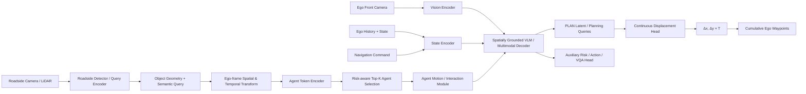
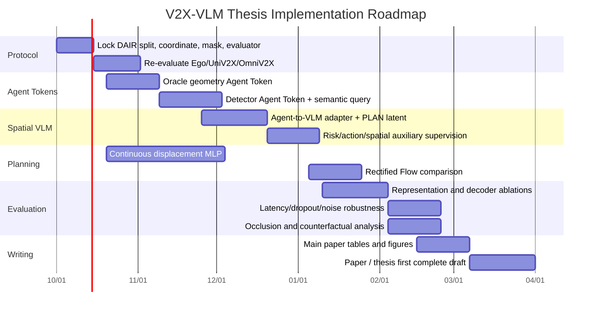

# 面向 DAIR-V2X 的 V2X–VLM 协同驾驶研究：SOTA、可创新空间与实验落地方案

## 执行摘要

截至 **2026 年 9 月**，你这个方向已经从“V2X 感知融合”快速演化到“**V2X 信息如何以规划友好的表示进入 foundation model / VLM，并最终产生连续、安全、低带宽的轨迹**”。DAIR-V2X 及其顺序版本 V2X-Seq 仍然是最适合你任务定义的真实车路协同数据体系：DAIR-V2X 提供真实 vehicle–infrastructure 多模态数据，而 V2X-Seq 进一步提供连续序列、轨迹、vector map 和交通灯；其中 SPD 有超过 15,000 帧、95 个场景，TFD 则包含约 80k infrastructure-view、80k vehicle-view 和 50k cooperative-view 轨迹场景。citeturn21search0turn21academia30

你的开题报告原本将研究路线定义为“**路侧稀疏 Query → 跨视域视觉重构 → VLM 语义推理/CoT → 自回归坐标 Token**”。fileciteturn0file5 结合你现在已经做到的 DAIR/V2X-Seq 坐标转换、轨迹构建以及 VLM 实验，我认为这个方向需要进行一次重要升级：**“路侧 Query 经过 ego-frame 转换再送入 VLM”本身已经不足以成为核心创新点**。原因是 2026 年 8 月出现的 AURORA 已经显式进行 roadside spatial query 到 ego 侧的 Cross-View Query Alignment and Fusion，并把统一 token 送入 LoRA-VLM，再从专门 waypoint token 的 hidden state 驱动连续轨迹 planner。换言之，你原本设想中“Query 对齐 + VLM + continuous trajectory”的大框架已经出现高度相似工作。citeturn18academia31 fileciteturn0file1

因此，我更建议把你的论文核心收敛为：

> **Planning-aware, uncertainty-aware and interaction-aware V2X Agent Tokens + Spatially Grounded VLM + Continuous Ego Planner**

也就是不要把“roadside query”当成创新本身，而是把它升级成 **Agent-centric cooperative representation**：


\boxed{
\text{Roadside Perception}
\rightarrow
\text{Agent Tokens}
\rightarrow
\text{Ego-centric Spatial Grounding}
\rightarrow
\text{Agent Motion / Risk Reasoning}
\rightarrow
\text{VLM Latent}
\rightarrow
\text{Continuous Ego Planner}
}


这里最有论文价值的三个创新方向是：


| 优先级     | 建议创新                                            | 为什么仍然有空间                                                                                                                                                                        |
| ------- | ----------------------------------------------- | ------------------------------------------------------------------------------------------------------------------------------------------------------------------------------- |
| **核心一** | **Time/Uncertainty/Planning-aware Agent Token** | OmniV2X 已用 SDSM object token，但其模型输入向量主要是位置、尺寸、朝向、速度、类别；你可以进一步显式建模 timestamp/message age、定位/检测 uncertainty、source visibility、RSU-only、TTC/conflict 等规划属性。fileciteturn0file3   |
| **核心二** | **Agent Motion Grounding for VLM**              | UniMM-V2X/V2X-Graph 已证明 cooperative motion information 有价值，但尚未充分解决“如何把未来 agent interaction 显式 grounding 给 VLM，让 VLM 理解谁会和 ego 冲突”。citeturn7search2turn22search0             |
| **核心三** | **VLM 理解、连续 head 规划**                           | DriveVLM-Dual、SOLVE、AURORA 和 OmniV2X 都在说明一个趋势：VLM 更适合语义/意图层，精确几何最好交给连续 planner；你可以把它做成 V2X 场景下的系统化验证，而不是继续让 VLM 用文本“数坐标”。citeturn20academia34turn18search8turn18academia31 |


对 baseline，我不建议铺太多。**真正需要跑的只有三组：OmniV2X、UniMM-V2X、UniV2X；再加一个你自己实现的 Direct-VLM diagnostic baseline。** OmniV2X 最接近你未来的 object/agent token 路线；UniMM-V2X 是目前 DAIR 上非常强的 query-level multi-stage cooperative baseline；UniV2X 是 DAIR cooperative E2E 的共同历史锚点。V2X-VLM 很重要，但截至目前官方 GitHub 仍只有 README、没有可复现训练代码，因此它更适合做文献结果和你自己的 Direct-VLM 对照，而不适合成为必须完整复现的 baseline。citeturn9search0turn18search3turn7search2turn7academia46

最关键的实验也不应该是十几个小消融，而是围绕三个问题：

> **路端究竟应该传什么？**  
> **VLM 是否真的理解了 roadside-only agent 与 ego 的空间/未来交互？**  
> **这种理解最终有没有改善连续轨迹，而且在 latency/dropout/noise 下仍然有效？**

这三问足以形成一篇结构清晰的硕士论文甚至投稿工作。

## 项目背景、数据集与研究边界


### 为什么 DAIR-V2X 应该继续作为主数据体系

你的任务不是普通单车自动驾驶，而是明确的：

  
\text{Vehicle observation}  
+  
\text{Roadside observation}  
\rightarrow  
\text{Ego future trajectory}.  


DAIR-V2X 官方仓库目前同时维护 DAIR-V2X 和 V2X-Seq。DAIR-V2X 总体包含 71,254 图像帧和 71,254 点云帧；V2X-Seq 则是顺序车路协同数据，其中 SPD 超过 15,000 帧、95 个真实序列，TFD 提供 vehicle、infrastructure 和 cooperative 三种轨迹预测视角，并覆盖 28 个路口。

更重要的是，2025 年 CVPR MEIS 的 **End-to-End Autonomous Driving through V2X Cooperation Challenge** 直接建立在 **UniV2X + V2X-Seq-SPD** 之上。Track 2 的输入明确包括 vehicle front-view image、infrastructure image、command、ego states 和 calibration，这实际上与你的任务定义高度一致。citeturn18search1turn18academia27

所以你的论文主 benchmark 最好固定为：

> **DAIR-V2X / V2X-Seq-SPD-New + UniV2X/Challenge scene split +统一 ego coordinate +统一 trajectory horizon。**

你当前内部方案同样已经把 DAIR/V2X-Seq、ego/LiDAR 坐标系、future validity、连续 trajectory head 和 OmniV2X/UniMM-V2X baseline 作为主线，这个方向是正确的。fileciteturn0file0

### 哪些相似数据集值得补充，但不应取代 DAIR


| Dataset                | 真实 Vehicle + Infrastructure | 时序        | 轨迹/Tracking                          | 对你的用途                        |
| ---------------------- | --------------------------- | --------- | ------------------------------------ | ---------------------------- |
| **DAIR-V2X / V2X-Seq** | ✅                           | ✅ V2X-Seq | ✅ Tracking、Forecasting、E2E challenge | **主数据集**                     |
| **TUMTraf-V2X**        | ✅                           | ✅         | ✅ track ID                           | 外部 perception/generalisation |
| **V2X-Real**           | ✅，且含多车+多 RSU                | ✅         | 以 cooperative perception 为主          | 外部 object-token 鲁棒性          |
| **UrbanIng-V2X**       | ✅，多车+多 infrastructure       | ✅ 10 Hz   | ✅ 3D annotation                      | 多 RSU/多 agent 扩展             |
| **V2X-Radar**          | ✅                           | ✅         | 3D perception                        | radar/adverse-weather 扩展     |


TUMTraf-V2X 是真实 V2I 数据集，含 2,000 个标注点云、5,000 张图像、约 30k 3D boxes 及 track IDs，并覆盖 U-turn、near-miss 等复杂场景；它非常适合测试你的 roadside detector/Agent Token 是否跨数据集有效，但没有 DAIR 这一套成熟 E2E planning protocol。

V2X-Real 使用两辆 connected vehicles 和两个 smart infrastructures，包含 33k LiDAR frames、171k camera data 和超过 1.2M 3D boxes；它尤其适合以后测试多 source 的 Agent Token，但它主要是 cooperative perception benchmark。citeturn13search5turn13academia48

UrbanIng-V2X 更进一步包含两辆车、多个基础设施传感杆和三个真实城市路口，共 34 个时序场景、约 712k 3D annotated instances；如果你未来要从“一个 RSU”扩展成“多个 source agent”，它是很好的第二数据集。citeturn13search0turn13search4

另外，V2X-Radar 提供真实 vehicle–roadside 的 4D Radar、LiDAR 和 multi-view camera，共约 20k LiDAR、40k camera 和 350k bounding boxes，可以成为论文未来工作的 adverse-weather 扩展，但现在没有必要增加主线复杂度。citeturn22academia35

**结论：硕士论文阶段不要换数据集。** DAIR-V2X/V2X-Seq 是主线；TUMTraf-V2X 最多做一个 detector/Agent Token 外部泛化实验。

## 相关工作与当前 SOTA 地图


### 与你的项目直接相关的 V2X 方法


| 方法             | 输入与路端信息                                                        | 融合/Backbone                                            | 轨迹或任务 Head                                      | Dataset / protocol                                  | 开源状态                                                                                                                   |
| -------------- | -------------------------------------------------------------- | ------------------------------------------------------ | ----------------------------------------------- | --------------------------------------------------- | ---------------------------------------------------------------------------------------------------------------------- |
| **UniV2X**     | ego+RSU sensor；传 Agent Query、Lane Query、occupancy              | UniAD-style BEV + sparse–dense hybrid fusion           | UniAD-style motion/occupancy/planner            | DAIR-V2X；原论文与后续 1/2/3 s benchmark protocol 需区分      | [Official code](https://github.com/AIR-THU/UniV2X) ✅ citeturn18search3turn13academia50                             |
| **V2X-VLM**    | vehicle image + infrastructure image + text scene descriptions | VLM + visual/text contrastive alignment + distillation | VLM-based future trajectory generation          | DAIR-V2X；必须按其原 protocol 单独解释结果                      | [Repo](https://github.com/zilin-huang/V2X-VLM) ⚠️ 目前无完整训练代码 citeturn23search0turn9search0                          |
| **OmniV2X**    | ego front image + nav + SDSM-like object tokens + optional MAP | frozen DINOv3 + modality encoders + cross-attention    | **Rectified Flow, displacement**                | nuPlan pretrain → DAIR-V2X-Seq fine-tune；主表 1/2/3 s | [Official code](https://github.com/JuntongPeng/OmniV2X) ✅ citeturn7academia46 fileciteturn0file3                 |
| **UniMM-V2X**  | track/map/occ queries + cooperative motion query               | multi-level fusion + BEV/Motion MoE                    | UniAD-family planner                            | DAIR-V2X；1/2/3 s                                    | [Official code](https://github.com/Souig/UniMM-V2X) ✅ citeturn7search2 fileciteturn0file2                        |
| **AURORA**     | roadside spatial queries，而不是完整 dense semantic feature          | CQAF → unified tokens → LoRA VLM                       | `<wp>` hidden state → probabilistic VAE planner | **V2XBench，不是 DAIR**；open+closed loop               | 论文/benchmark 已公开，当前不建议作 DAIR 主 baseline citeturn18academia31 fileciteturn0file1                                  |
| **V2X-Graph**  | cooperative agent history/interaction trajectories             | interpretable graph cooperative representation         | multi-agent motion forecasting                  | **V2X-Seq-TFD + V2X-Traj**                          | [Official code](https://github.com/AIR-THU/V2X-Graph) ✅ citeturn22search0turn22search9                             |
| **QUEST**      | **instance query stream**                                      | cross-agent query fusion + complementation             | cooperative perception，无 ego planner            | DAIR-V2X-Seq camera cooperation                     | [Repo](https://github.com/leofansq/QUEST)；作者明确表示核心训练代码不完全开放 citeturn14search5turn14search13                        |
| **CooperNaut** | V2V LiDAR compact point messages                               | point encoder + representation aggregator              | direct control/driving model                    | AutoCastSim，V2V simulation                          | [Official code](https://github.com/UT-Austin-RPL/Coopernaut) ✅；不是 DAIR/V2I baseline citeturn16search0turn16search2 |


这张表里有一个非常重要的演进：


\text{Dense BEV}
\rightarrow
\text{Sparse Queries}
\rightarrow
\text{Structured Objects}
\rightarrow
\text{Semantic/Agent Tokens}.


UniV2X 仍然是“协同 feature/query → perception/prediction/planning”的经典方案；UniMM-V2X 又证明了不仅 perception query 可以协同，**motion query 本身也值得协同**。其论文在 DAIR-V2X 上报告，相对 UniV2X，perception、prediction 和 planning 均进一步改善；其公开表中 1/2/3 s 平均规划 L2 从 UniV2X 的约 2.23 m 降至 1.49 m，并把平均 collision rate 从约 0.25% 降至 0.12%。citeturn7search2 fileciteturn0file2

OmniV2X 则把路线推进到另一个方向：**不传 BEV、不传高维 query，而是传标准化对象状态。** 它在模型内部把一个对象表示为


[x,y,z,l,w,h,\sin\theta,\cos\theta,v_x,v_y,
c_{veh},c_{ped},c_{cyc}],


共 13 维，再通过 lightweight Transformer 转成 V2X context token。它在 DAIR-V2X-Seq 的 1/2/3 s protocol 中报告约 0.86 m 平均 L2，并将 16 个 object、2 Hz 的理论 object-message payload 计算为 1,408 Byte/s；加入 MAP 后为约 25,792 Byte/s。这些数值使用论文自身的通信计数定义，不能直接和所有论文的 bit/s 或实际协议 payload 等价。fileciteturn0file3

AURORA 对你尤其重要，因为它和你的开题思路发生了明显重叠：它已经把 roadside 的 spatial detection/map queries 变换进 vehicle frame，通过 CQAF 融合，然后使用 LoRA-VLM，再从一个 waypoint token 的 latent hidden state 进入连续 VAE planner。AURORA 在 V2XBench 的闭环实验中报告 98.21% Route Completion 和 76.02 Driving Score，但这是 simulation V2XBench，不是 DAIR，所以不能拿这些结果和 OmniV2X/UniMM 的 DAIR L2 横向排列。citeturn18academia31 fileciteturn0file1

### 你应借鉴、但不应直接当 DAIR baseline 的单车/预测方法


| 方法                | 最值得你借鉴的东西                                           | 输出范式                                      | 数据集                              | 对你的价值                                                             |
| ----------------- | --------------------------------------------------- | ----------------------------------------- | -------------------------------- | ----------------------------------------------------------------- |
| **UniAD**         | query-based perception→motion→planning hierarchy    | deterministic planning + motion/occupancy | nuScenes；后续 repo 加 NAVSIM/nuPlan | 你整个 query pipeline 的祖先架构 citeturn17search1turn17search5       |
| **MTR / MTR++**   | intention query、多 agent future interaction          | K-mode multimodal trajectory              | Waymo Motion                     | **Agent Motion Head** 最值得借鉴 citeturn15search0turn15academia24 |
| **MotionLM**      | 把 multi-agent future 当成 joint sequence              | discrete motion tokens + autoregression   | Waymo Motion                     | 借“interaction modelling”，不建议借最终离散轨迹接口 citeturn15search3        |
| **GameFormer**    | ego 与其他 agent 的交互博弈联合建模                             | hierarchical interactive decoder          | Waymo + nuPlan                   | 可以给你 Agent→Ego interaction 设计依据 citeturn17search0              |
| **SparseDriveV2** | 超大 trajectory vocabulary + path/speed factorisation | candidate scoring                         | NAVSIM + Bench2Drive             | 可作轨迹 head 的未来扩展，但当前不宜抢主线 citeturn15academia25                  |


V2X-Graph 其实对你比很多 VLM paper 更值得仔细看。它不是 planning model，而是专门研究“**基础设施观察到的历史 motion/interaction information 如何提高未来 motion forecasting**”，并在 V2X-Seq V2I 场景验证 cooperative trajectory representation。citeturn22search0

这给你的启示是：roadside token 不应该只回答

> “那里有一辆车。”

它最好逐步升级为：

> “这是一个 ego 看不到/看不完整的 agent；它在 ego frame 的位置和速度是什么；它可能在未来 2–3 s 到达哪里；它和 ego candidate path 是否存在冲突。”

这会把你的研究从“V2X feature fusion”真正推进到：


\boxed{\text{V2X Cooperative Interaction Reasoning}}


而不是再做一个 Query Fusion 变体。

## 技术路线调研：V2X 表示、空间大模型与轨迹 Head


### V2X 端到底应该传什么

SAE J3224 定义的 Sensor Sharing Service/SDSM 用于车辆和 RSU 共享**检测到的 road users / objects 的位置、尺寸、运动等信息**；它强调 object-level sensor sharing，而不是要求传原始 camera/LiDAR。citeturn12search2 这里需要特别澄清：**OmniV2X 的 13D vector 是它自己用于网络输入的 SDSM-inspired vectorisation，不是 SAE J3224 规范原封不动定义的“13维报文”。** SAE 标准定义的是消息和字段语义。citeturn12search2 fileciteturn0file3

V2X cooperative perception 大致已经形成如下梯度：


| 表示                                  | 代表工作                | 优势                              | 缺点                            | 对你建议                                       |
| ----------------------------------- | ------------------- | ------------------------------- | ----------------------------- | ------------------------------------------ |
| raw image / point cloud             | early fusion        | 信息最完整                           | 带宽最大、异构严重                     | ❌                                          |
| dense BEV feature                   | V2VNet / BEV fusion | 空间统一、效果强                        | 大带宽、模型强耦合                     | 只作历史 baseline                              |
| spatially selected BEV              | Where2comm          | 只传高置信区域                         | 仍依赖共享 feature space           | 可借“选择谁/传哪里”思想 citeturn6search13         |
| aligned intermediate feature        | CoAlign / HEAL      | 支持 pose/heterogeneous agent     | 仍需要 feature-space alignment   | detector 层参考 citeturn14search4          |
| instance/query                      | QUEST / UniV2X      | 稀疏、instance-level               | query 与 detector/backbone 强绑定 | 很接近你原方案 citeturn14search5turn18search3 |
| object/SDSM                         | OmniV2X             | 极低带宽、模型无关、可解释                   | 丢失视觉 appearance/语义            | **最适合你的几何主干** fileciteturn0file3        |
| **geometry + semantic agent token** | **你的建议方案**          | 保留标准几何，同时给 VLM semantic context | 需要设计 adapter/训练监督             | **最值得做**                                   |


DAIR-V2X 官方 benchmark 本身就展示了这种通信权衡：原始/早期点云 fusion 的通信量远大于 detection-level late fusion，而性能通常也更高；这正是为什么后来大量工作转向稀疏通信。citeturn21search0 Where2comm 用 spatial confidence map 只选择任务关键区域，QUEST 则进一步从 feature region 转为 instance query cooperation。citeturn6search13turn14search13

对你的实现，我推荐不要只传一个 learned `Q_i`，而是每个 agent 保留一条**显式 geometry/state channel**：


g_i =
[
x,y,z,l,w,h,
\sin\psi,\cos\psi,
v_x,v_y,
c_i,s_i,
\Delta t_i,
\sigma_x,\sigma_y,\sigma_v,
r_i
].


其中：

- c_i,s_i：类别和 detector confidence；
- \Delta t_i=t_{current}-t_{msg}：message age；
- \sigma：定位/检测不确定性；
- r_i：roadside-only / ego-visible / both-visible、source ID、或者 risk feature。

然后再附一个学习型 semantic query：


q_i^{sem}\in\mathbb R^D.


最终：


a_i=
\text{AgentAdapter}
(
g_i,
q_i^{sem},
e_{\text{source}},
e_{\text{visibility}}
).


这种**显式 geometry + learned semantics 双通道**比纯 query 更有研究价值，因为纯 query 已经被 QUEST/UniV2X/AURORA 探索，而 object-only 又已经被 OmniV2X 探索。你的新位置正好是二者之间。这个建议也与你当前实验计划中提出的 geometry、uncertainty、message age、source/visibility、risk token 设计一致。fileciteturn0file0

### Ego-frame 空间 grounding 应该成为方法的一部分，而不是 preprocessing 脚注

你现在做的 global → ego transform，其实应该写进 method。

对于全局坐标的路侧 agent：

# 
p_i^e

R_{e}^{T}
(p_i^g-t_e^g),


速度：

# 
v_i^e

R_e^{T}v_i^g,


相对朝向：

# 
\psi_i^e

\operatorname{wrap}
(\psi_i^g-\psi_e^g).


对于存在 latency 的消息，还应该先或在一致时间框架中进行 motion compensation：

# 
\tilde p_i(t)

p_i(t_m)
+
v_i(t_m)\Delta t,
\qquad
\Delta t=t-t_m.


然后再生成 ego-frame token。训练阶段随机注入 latency、position noise、yaw noise 和 object dropout。

这不是纯工程细节。QUEST、UniV2X、AURORA 都证明 cross-view alignment 是 cooperative representation 的关键，而 OmniV2X 又明确依赖 global→ego message alignment；因此你把 **temporal alignment + uncertainty encoding** 放进 Agent Token 是有充分研究动机的。citeturn14search13turn18search3turn18academia31 fileciteturn0file3

### 空间大模型给你的真正启示

通用 VLM 的弱点恰恰是你这个课题最有空间的地方。

SpatialVLM 的核心观察是：普通 VLM 对 metric 3D distance、size 和 quantitative spatial relation 并不擅长；通过大规模 3D spatial VQA supervision，它才能明显增强这些能力。citeturn19search1turn19search2 SpatialRGPT 则采用 3D scene graph 和 depth plugin，把 region 与真实距离、方向联系起来，从而提高 grounded spatial reasoning。citeturn19academia48

因此对于 V2X 来说，一个非常重要的研究判断是：

> **不要让 VLM 自己从“一个路端图 + 一个车端图”猜两个视角之间的 3D 对应关系。先由几何模块告诉它 ego-centric spatial facts，再让 VLM 做关系、风险和决策推理。**

这实际上比你开题中“把 roadside query 画回 ego image，然后希望 VLM 看懂”的方案更稳健。你在早期实验中也已经观察到，仅在路端/融合图像中做简单 ego 标记，并不能稳定带来 trajectory improvement。fileciteturn0file4

Florence-2 一类 prompt-driven vision foundation model 的优势是 image/text interface 和结构化视觉任务，但它本身并不等于 metric 3D reasoning model。SpatialVLM/SpatialRGPT 的结果恰好说明，真正的 quantitative spatial reasoning 需要额外 3D supervision 或 explicit geometry。citeturn5search1turn19academia48

DINOv3 则代表另一条路线：不要强迫所有视觉信息先变语言，而是使用强 frozen vision representation，再把 planning-relevant context 注入连续 planner。OmniV2X 就采用 frozen DINOv3 visual encoder + V2X object context + Rectified Flow，避免让语言 token 承担全部几何精度任务。citeturn5academia48 fileciteturn0file3

自动驾驶 VLM 本身也在向“**VLM 做慢语义、大/小连续网络做快规划**”发展。DriveVLM-Dual 明确提出 VLM 与 conventional driving stack 的 slow-fast combination；SOLVE 则让 VLM 与 E2E branch 共享 feature，并利用异步 cooperation；AURORA 的 VLM 输出同样不是最终字符串坐标，而是由 waypoint token latent conditioning continuous planner。citeturn20academia34turn18search8turn18academia31

所以你目前的判断：

> **“VLM 负责理解，连续 head 负责精确运动学。”**

是对的，而且比你开题报告原本“CoT → discrete coordinate tokens”的技术路线更符合 2026 年的文献演化。原开题仍然可以保留“语义映射”和“因果推理”的研究目标，但最终 decoder 应当更新。fileciteturn0file5

### 轨迹 Head 应该怎么选

目前最值得你比较的是四类。


| Head                             | 输出                               | 训练                                | 优势           | 你该怎么用                |
| -------------------------------- | -------------------------------- | --------------------------------- | ------------ | -------------------- |
| **Deterministic continuous MLP** | T\times2                         | Huber/L1/L2                       | 最稳定、因果最清楚    | **主模型第一版**           |
| **K-mode multimodal**            | K\times T\times2 + p_K           | WTA/min-of-K + classification/NLL | 能表示多未来       | Agent prediction 很适合 |
| **Diffusion / Rectified Flow**   | stochastic continuous trajectory | denoising / flow matching         | 多模态、连续、生成能力强 | MLP 稳定后第二阶段          |
| **Candidate scoring**            | trajectory vocabulary score      | classification/ranking            | 轨迹天然可行、性能强   | 暂不做主线                |


MTR/MTR++说明 K 个 intention queries 能有效分担不同 motion modes，MTR++ 又进一步显式建模多 agent future interactions，因此很适合你的 **roadside Agent Motion Head**。citeturn15search0turn15academia24

MotionLM 将连续未来离散化为 motion token，并用普通 language-modelling log-likelihood 建模多个 agent 的 joint future，其最大的启发是“**多 agent future 可以作为一个联合序列建模**”，而不是“最终 ego 坐标必须离散成文本”。citeturn15search3

DiffusionDrive 则证明短步数 diffusion 可以实时生成多模态 driving trajectories；它通过 multi-mode anchors 把 diffusion 截断到仅少量 denoising steps，并在 NAVSIM 上报告实时性能。citeturn17search3 OmniV2X 进一步把 Rectified Flow 应用到 V2X cooperative planning，并明确发现其设置下预测 step-wise displacement 比直接 absolute waypoint 更容易泛化。fileciteturn0file3

SparseDriveV2 代表 candidate-scoring 路线：它不直接回归所有连续未来，而是把 trajectory vocabulary 分解成 geometric path × velocity profile，再进行 coarse-to-fine scoring。这个方向很强，但会把你的论文贡献从“V2X/VLM spatial reasoning”拉向“trajectory vocabulary”，因此暂时不建议投入。citeturn15academia25

## 推荐实现：把你的方案升级成 Agent-Grounded V2X–VLM


### 推荐最终架构

我建议你最终论文的方法结构收敛为下面这样：




这里最大的设计变化是：**不要再把 roadside query 先强制“重画成图片”，然后完全依赖 VLM 从像素里重新识别它。** 你可以保留 visual overlay 作为辅助输入或可视化，但主信息应该直接以 structured Agent Token 进入模型。

这同时保留了你开题中“跨视域空间映射”和“场景语义映射”两大研究内容，却避免了视觉重构的信息损失。你的开题目标本质上是解决带宽、视域异构和 VLM 几何认知鸿沟，而不是必须使用某一种图片重建形式。fileciteturn0file5

### Agent 的概念应该怎么加

这里的 Agent 不是“LLM autonomous agent”，而是**traffic agent**：vehicle、pedestrian、cyclist 等交互对象。

对于第 i 个对象，我建议保留三层 representation：


A_i =
[
A_i^{state},
A_i^{motion},
A_i^{risk}
].


第一层：


A_i^{state}=
[x,y,z,l,w,h,
\sin\psi,\cos\psi,
v_x,v_y,
class,confidence,
age,uncertainty,visibility].


第二层：

# 
A_i^{motion}

\hat\tau_i^{1},...,\hat\tau_i^{K},


或者第一版只使用


[\hat v_i,\hat a_i,\hat p_i^{1s},
\hat p_i^{2s},\hat p_i^{3s}].


第三层计算 planning interaction：


A_i^{risk}=
[
TTC_i,
d_{route,i},
d_{conflict,i},
RSUOnly_i,
occluded_i
].


MTR++、GameFormer 和 V2X-Graph 都说明对动态 agent 的未来和交互显式建模比只看当前位置更合理；UniMM-V2X 又进一步证明 cooperative motion queries 能提高最终 planning。citeturn15academia24turn17search0turn22search0turn7search2

这很可能是你最有价值的研究升级：


\boxed{
\text{Roadside Query}
\rightarrow
\text{Roadside Agent}
\rightarrow
\text{Roadside Agent Future}
\rightarrow
\text{Ego-Agent Interaction}
}


### Planning-aware communication 可以成为真正的 V2X 创新

当前很多 cooperative perception 方法回答：

> 哪些 feature 对 detection 最重要？

例如 Where2comm 根据 spatial confidence 决定通信区域。citeturn6search13

你的系统可以改为回答：

> **哪些 roadside agents 对 ego planning 最重要？**

定义一个简单的 risk score：


r_i =
w_1f(TTC_i)
+
w_2f(d_{route,i})
+
w_3f(d_{conflict,i})
+
w_4I_{\text{RSU-only}}
+
w_5s_i.


只传/选择：


TopK(A_i,r_i).


然后比较：


TopK_{\text{nearest}}
\quad vs\quad
TopK_{\text{confidence}}
\quad vs\quad
TopK_{\text{planning-risk}}.


这个实验很好，因为它同时回答：

- 通信效率；
- roadside information 的实际价值；
- VLM 是否关注 planning-critical agent。

比单纯再设计一个 attention block 更容易形成明确论文贡献。

### VLM 应该承担什么职责

推荐的职责分界是：


\boxed{
VLM:
\text{What is happening? Why is it dangerous? What should ego do?}
}


而不是：


\boxed{
VLM:
\text{Please spell 18 floating-point numbers correctly.}
}


你可以给 VLM 一个或多个 `[PLAN]` queries，并取其 hidden state：

# 
z_{plan}

H_{\text{VLM}}[\text{PLAN}].


同时训练 auxiliary heads：


\hat a_{lat}
\in
\text{left,straight,right},


\hat a_{lon}
\in
\text{accelerate,maintain,decelerate,stop},


以及：

# 
\hat r_i

P(\text{agent }i\text{ affects ego}).


训练时可以有 VQA / scene description / risk explanation；推理时**不需要逐 token CoT**才能得到 trajectory。

这与你当前优化计划提出的“VLM latent semantic representation + continuous trajectory head + optional semantic/action loss”完全一致。fileciteturn0file0

### 连续轨迹 Head

第一版建议输出：

# 
\hat{\Delta P}

[\Delta x_1,\Delta y_1,\ldots,\Delta x_T,\Delta y_T].


然后：

# 
\hat P_t

\sum_{\tau=1}^{t}\hat{\Delta P}_\tau.


不要只监督 displacement，建议同时监督累积 waypoint：

# 
\mathcal L_{\text{pos}}

\frac{\sum_t m_t
\rho(\hat P_t-P_t)}
{\sum_t m_t+\epsilon},


# 
\mathcal L_{\Delta}

\frac{\sum_t m_t
\rho(\hat{\Delta P}_t-\Delta P_t)}
{\sum_t m_t+\epsilon},


# 
\mathcal L_F

\rho(\hat P_{T_v}-P_{T_v}),


其中 m_t 是 future-valid mask，T_v 是最后一个有效 future index，\rho 推荐 Smooth-L1/Huber。

最终第一阶段：


\boxed{
\mathcal L=
\mathcal L_{\text{pos}}
+
\lambda_\Delta\mathcal L_\Delta
+
\lambda_F\mathcal L_F
+
\lambda_{col}\mathcal L_{col}
+
\lambda_{smooth}\mathcal L_{smooth}
+
\lambda_{sem}\mathcal L_{sem}
}


这里需要强调你之前数据处理中已经暴露出的关键问题：future 缺失不能再作为有效 `(0,0)` GT，history 也不能被误作 future；所有 loss 和 metrics 必须经过 validity mask。fileciteturn0file4

如果仍使用当前 `B × 9 × 2`，假设时间间隔是 0.5 s，那么训练可以覆盖到 4.5 s，但**主论文表建议另外抽取 1/2/3 s 的点作为 DAIR common protocol**：


1s\rightarrow t_2,\quad
2s\rightarrow t_4,\quad
3s\rightarrow t_6.


4.5 s FDE 可以作为 supplementary metric。这样不会为了 benchmark 丢掉你已有 9-point target，又能与 OmniV2X/UniMM 等结果更方便地重新评测。OmniV2X 和 UniMM-V2X 公开的共同规划表均采用 1/2/3 s。fileciteturn0file2 fileciteturn0file3

### 推荐训练顺序

不要同时训练所有创新。

**Stage A：Ego-only continuous planner**

```text
ego image + state + command
        ↓
vision/VLM latent
        ↓
MLP displacement head
```

先确保 trajectory evaluator、mask、coordinate、split 全部可靠。

**Stage B：Oracle Agent Tokens**

直接用 GT roadside boxes / tracks 构造 agent tokens：

```text
GT RSU Agents
   ↓
ego transform
   ↓
Agent Encoder
   ↓
VLM
   ↓
trajectory
```

这一步非常关键，它回答：

> 假设 roadside perception 完美，我的方法思想有没有用？

**Stage C：Detector Agent Tokens**

把 Oracle 换成 CenterPoint / UniV2X / 你自己的 sparse detector output。

此时才能回答：

> improvement 在现实 perception noise 下还剩多少？

**Stage D：Spatial/Semantic supervision**

加入：

- risk classification；
- action classification；
- agent-impact VQA；
- RSU-only object reasoning；
- visibility/source label。

VLM 可以使用 LoRA，不需要一开始 full fine-tune。

**Stage E：Robustness training**

加入：


latency,\quad dropout,\quad
pose\ noise,\quad detector\ noise,


并显式输入 message age + uncertainty。

**Stage F：Rectified Flow**

只有 MLP 版本稳定后，再把 decoder 换掉：


\text{Same encoder}
+
\text{Same Agent Tokens}
+
\text{Same dataset}


只比较：


MLP
\quad vs\quad
Rectified Flow.


OmniV2X 的两阶段策略也支持“先用大规模 ego-only data 获得 driving prior，再用较少 V2X data adaptation”：它先在 nuPlan `navtrain` 预训练，再适配 DAIR-V2X-Seq，并报告仅使用少量 DAIR cooperative data 时依然能明显受益于预训练。citeturn7academia46 fileciteturn0file3

所以如果算力允许，你可以做：


\text{nuPlan ego planning}
\rightarrow
\text{DAIR ego-only}
\rightarrow
\text{DAIR V2X}.


如果算力有限，**不要为了复刻 OmniV2X 的 foundation-pretraining 耽误主创新**；可以使用冻结 DINOv3 / pretrained VLM + DAIR adapter/head training。

## Baseline、消融与论文级实验设计


### 最终只建议维护三套正式 baseline


| Baseline      | 怎么处理                                         | 原因                                                                                                           |
| ------------- | -------------------------------------------- | ------------------------------------------------------------------------------------------------------------ |
| **UniV2X**    | **官方 checkpoint / evaluator 跑一遍，不建议大规模重新训练** | DAIR E2E cooperative 的共同基准，负责说明传统 query fusion 水平。官方代码已公开。citeturn18search3                               |
| **UniMM-V2X** | **优先使用官方 code/checkpoint；有资源再 finetune**     | 是 query/motion-level cooperation 的强基线；论文完整训练用了 8×A800，没必要为硕士论文完全重训。citeturn7search2 fileciteturn0file2 |
| **OmniV2X**   | **重点复现，至少完整跑官方 validation protocol**         | 与你的 Agent/Object Token + continuous planner 最接近，是最重要 competitor。citeturn7academia46 fileciteturn0file3 |


除此之外强烈建议增加一个**内部 diagnostic baseline**：


\boxed{\text{Direct-VLM}}


```text
ego image + roadside image
        ↓
same VLM
        ↓
same continuous trajectory head
```

它不需要声称“复现 V2X-VLM”，因为 V2X-VLM 的完整代码目前仍未公开；但它能公平回答：

> **为什么要 Agent Token？直接把 roadside image 丢给 VLM 不行吗？**

这反而比拿 V2X-VLM 论文里另一套 pipeline 的 published number 硬比较更科学。V2X-VLM 的官方 repo 截至当前仍写明正在整理代码，核心训练代码不可直接复现。citeturn9search0turn23search0

### 主结果表应该这样设计

**Table: Main results on DAIR-V2X-Seq**


| Method     | V2X Representation  | L2@1s ↓ | L2@2s ↓ | L2@3s ↓ | Avg L2 ↓ | FDE ↓ | Collision ↓ | BPS ↓ | Latency ↓ |
| ---------- | ------------------- | ------- | ------- | ------- | -------- | ----- | ----------- | ----- | --------- |
| Ego Only   | —                   |         |         |         |          |       |             | 0     |           |
| Direct-VLM | RSU image           |         |         |         |          |       |             | high  |           |
| UniV2X     | query + occupancy   |         |         |         |          |       |             |       |           |
| UniMM-V2X  | multi-level queries |         |         |         |          |       |             |       |           |
| OmniV2X    | object/SDSM         |         |         |         |          |       |             |       |           |
| **Ours**   | Agent Token         |         |         |         |          |       |             |       |           |


不要复制各论文里的 L2 直接放进同一个表。UniAD/UniV2X/V2X-VLM/OmniV2X 历史论文在 horizon、split、trajectory construction、post-processing 和 evaluator 上并不总是一致。2025 年 V2X E2E Challenge 的出现本身就是为了推动统一 benchmark。citeturn18academia27

所以**你的主表所有数字必须来自你的统一 evaluator**；外部 published results 放在 Related Work，不放到 Ours 主表中直接宣称 SOTA。

### 最值得做的三个消融


#### 消融：路端究竟该传什么

这是你全文最重要的 ablation。


| Variant | Input                                     |
| ------- | ----------------------------------------- |
| A0      | Ego only                                  |
| A1      | Ego + roadside image                      |
| A2      | Ego + **geometry object state**           |
| A3      | Ego + **learned semantic query**          |
| A4      | Ego + **geometry + semantic Agent Token** |


假设是：


A4 > A2 \approx A3 > A0,


尤其是在 occluded / RSU-only agent subset 上，A4 应该最明显。

但这里的“>”是你的**研究假设，不是预设结果**。如果 A2 已经等于 A4，反而会得到一个很有价值的结论：

> 在当前 DAIR 规模下，高维 query semantic feature 未必比标准化 object state 更值得通信。

这与 OmniV2X 的极低带宽结果形成很有意思的讨论。fileciteturn0file3

#### 消融：时间、不确定性与 planning-aware communication

保持 Agent Encoder 不变：


| Variant | age | uncertainty | risk Top-K        |
| ------- | --- | ----------- | ----------------- |
| B0      | ✗   | ✗           | nearest           |
| B1      | ✓   | ✗           | nearest           |
| B2      | ✓   | ✓           | nearest           |
| **B3**  | ✓   | ✓           | **planning-risk** |


在下面条件测试：


latency=
0,100,300,500\text{ ms},


dropout=
0,10,30,50,


K=
4,8,16,32.


除了 Avg L2，还必须报告：


L2_{\text{RSU-only}},
\quad
Collision_{\text{occluded}},
\quad
BPS.


这样才能证明你的 communication design 不是“另一种 compression”，而是**planning-oriented communication**。

通信中断和 latency 本来就是 V2X 的现实问题；已有 V2X-INCOP 等工作表明历史信息和通信状态建模可以缓解消息缺失，而 2025 V2X challenge 也把 bandwidth-aware fusion、robust planning 明确列为关键研究问题。citeturn16academia26turn18academia27

#### 消融：VLM 和 trajectory head 到底各自贡献什么


| Variant | Semantic reasoner          | Decoder                     |
| ------- | -------------------------- | --------------------------- |
| C0      | no VLM / small Transformer | MLP                         |
| C1      | VLM latent                 | MLP absolute waypoint       |
| **C2**  | **VLM latent**             | **MLP displacement**        |
| C3      | VLM latent + semantic aux  | MLP displacement            |
| C4      | VLM latent + semantic aux  | Rectified Flow displacement |


这个消融可以直接回答两个审稿人一定会问的问题：

> “为什么需要 VLM？”  
> “为什么不是普通 MLP？”

同时不要只看 overall L2。VLM 的收益更可能发生在：

- occluded intersection；
- roadside-only hazard；
- left-turn conflict；
- pedestrian conflict；
- signal-controlled junction；
- unusual/long-tail scene。

DriveVLM 和 SOLVE 本身就把 VLM 的主要价值定位在复杂场景理解、long-tail reasoning 和高层 planning，而不是单纯在常规直行样本上降低几厘米误差。citeturn20academia34turn18search8

### 建议再加一个“是否真的用了路端”的因果实验

这是我认为很容易让论文质量上升一级的实验。

找出存在高风险 roadside-only agent 的样本 x，生成：

# 
x^{+}

\text{with critical RSU agent},


# 
x^{-}

\text{remove the critical RSU agent}.


比较：

# 
\Delta \tau

d(
\hat\tau(x^+),
\hat\tau(x^-)
).


同时比较模型的 predicted risk/action 是否改变。

如果 ego 本身看不到这个 agent，而删除 RSU agent 后预测几乎完全不变，就说明模型可能**没有真正利用 V2X**。

这比普通 attention heatmap 更强，因为它是在做 counterfactual attribution：

> “这个路端 agent 是否因果性地影响了 planner？”

对于 VLM 尤其重要，因为大模型很容易仅根据 history、command 或 ego visual shortcut 得到看似不错的 trajectory；2026 年 Drive-R1 甚至明确指出 driving VLM 可能严重依赖历史输入 shortcut，而没有真正利用视觉信息。citeturn19search6

### 推荐的 robustness 表

**Table: Robustness under V2X imperfections**


| Method                | Delay  | Dropout | Pos. Noise | Yaw Noise | Avg L2 ↓ | Collision ↓ | RSU-only L2 ↓ |
| --------------------- | ------ | ------- | ---------- | --------- | -------- | ----------- | ------------- |
| Ours w/o compensation | 300 ms | 0       | 0          | 0         |          |             |               |
| Ours                  | 300 ms | 0       | 0          | 0         |          |             |               |
| Ours                  | 500 ms | 30%     | 0.5 m      | 2°        |          |             |               |
| Ours w/o uncertainty  | 500 ms | 30%     | 0.5 m      | 2°        |          |             |               |
| Ours full             | 500 ms | 30%     | 0.5 m      | 2°        |          |             |               |


### 推荐的 agent subset 表

**Table: Where does V2X actually help?**


| Method               | All ↓ | Visible-by-ego ↓ | RSU-only ↓ | Occluded ↓ | Left-turn ↓ | Pedestrian-risk ↓ |
| -------------------- | ----- | ---------------- | ---------- | ---------- | ----------- | ----------------- |
| Ego Only             |       |                  |            |            |             |                   |
| Direct-VLM           |       |                  |            |            |             |                   |
| Geometry Token       |       |                  |            |            |             |                   |
| **Full Agent Token** |       |                  |            |            |             |                   |


这个表甚至可能比 overall main table 更能说明你的贡献。

## 研究创新定位、实施时间线与 To-do


### 论文的创新点建议重新写成下面三个

你的开题报告原本将贡献放在“稀疏感知—视觉重构”和“场景语义映射—CoT—轨迹 Token”。fileciteturn0file5 考虑到 2026 年 OmniV2X、UniMM-V2X 和尤其 AURORA 的出现，我建议最终论文中的创新点改写得更具体。

**创新点 A：面向规划的时空不确定性感知 V2X Agent Token。**

不是简单传 detector query，而是将：


\text{geometry}
+
\text{semantic feature}
+
\text{timestamp}
+
\text{uncertainty}
+
\text{visibility}
+
\text{planning risk}


统一编码为 ego-centric Agent Token；采用 planning-risk-aware token selection，在有限 token budget 下优先传递真正影响 ego trajectory 的 roadside agents。其目标从“提高 detection AP”转为“在相同通信预算下最小化 planning risk”。

**创新点 B：基于 Agent Motion Grounding 的 V2X–VLM 空间交互推理。**

不是要求 VLM 自己从异构双视角图像猜测空间关系，而是显式输入 ego-frame agent geometry 和可选未来 motion hypotheses，并通过辅助 supervision 学习：


\text{Agent}
\rightarrow
\text{Spatial Relation}
\rightarrow
\text{Risk}
\rightarrow
\text{Action}
\rightarrow
\text{Planning latent}.


这吸收 SpatialVLM/SpatialRGPT 的“显式 3D grounding”思想，同时把它落在 DAIR 的真实 vehicle–roadside planning 任务上。citeturn19search1turn19academia48

**创新点 C：语义认知与连续运动学解耦的 V2X Planner。**

VLM 通过 `[PLAN]` / agent-aware latent 建模 scene semantics、risk 和 intention；连续 displacement head / Rectified Flow 负责 trajectory geometry。训练时使用 semantic/risk auxiliary supervision，推理不依赖逐 token CoT。这个贡献不要宣传成“首次 continuous VLM planner”，因为 AURORA、DriveVLM-Dual 等已有相似大方向；更适合表述为：

> **在 V2X agent-grounded cooperative planning 中系统研究 semantic reasoning 与 continuous motion generation 的解耦。**

citeturn18academia31turn20academia34

### 你现在最不应该投入时间的东西

第一，不建议继续把“**把 query 画回自车图像**”当主创新。它可以保留为 visual prompt baseline，但 AURORA 已经把 cross-view spatial query alignment 做得更系统。citeturn18academia31

第二，不建议继续优化“**让 VLM 自回归文本坐标**”作为最终主方案。MotionLM 的 discrete token 有其 multi-agent probability modelling 价值，但它的任务和你的高精度 ego planning 不同；OmniV2X、DiffusionDrive 等当前趋势反而是在连续运动空间中生成。citeturn15search3turn17search3

第三，不建议自己从头设计复杂 roadside 3D detector。V2X detection 已经有 Where2comm、CoAlign、HEAL、QUEST、SparseComm 等大量工作；你的论文核心是 downstream planning，不是再刷 AP。HEAL 已经系统处理 heterogeneous collaborative perception，QUEST 又已经做到 instance-query cooperation。citeturn14search4turn14search5

**roadside detector 对你而言最好是基础设施，而不是论文主角。**

### 算力与数据建议

从现有工作的实际训练成本看，完整 UniMM-V2X 从头训练并不适合成为你必须完成的任务：作者报告 perception 阶段约 40 epochs、end-to-end 阶段约 20 epochs，并使用 8×A800。fileciteturn0file2

相反，OmniV2X 的结构更符合你的资源策略：其论文报告冻结 DINOv3，约 130M total / 44M trainable parameters；其 V2X adaptation 可在单 GPU 上完成，作者报告 RTX 5090 上低于约 10 小时，而大规模 nuPlan pretraining 才是更耗时阶段。fileciteturn0file3

因此现实配置建议是：


| 工作                                | 建议资源                        |
| --------------------------------- | --------------------------- |
| 数据 preprocessing / GT Agent Token | CPU + 足够磁盘，不需 GPU cluster   |
| Oracle Agent + MLP                | 单张 24 GB 级 GPU 通常足够作为目标     |
| 视觉 backbone + LoRA-VLM            | 推荐 24–48 GB 单卡；具体取决于 VLM 大小 |
| Flow head                         | 单卡可做                        |
| UniV2X / UniMM                    | 优先 checkpoint evaluation    |
| nuPlan foundation pretraining     | **Optional**，有资源再做          |


以上是项目规划估计，不是各方法统一硬件要求。

### 从现在开始的现实时间线

以当前 **2026-09-30** 为起点，可以按下面的节奏推进：




### 最终 To-do 清单

按照优先级，你现在真正需要完成的是：


| Priority | Task                                      | 完成标志                                                      |
| -------- | ----------------------------------------- | --------------------------------------------------------- |
| **P0**   | 固定 scene-disjoint split                   | 所有模型完全同一 train/val IDs                                    |
| **P0**   | 修完 trajectory GT pipeline                 | future valid mask、ego-frame、timestamp 全通过可视化 sanity check |
| **P0**   | 固定 evaluator                              | L2@1/2/3s、FDE、collision、off-road、valid sample count       |
| **P1**   | Ego-only continuous displacement baseline | 稳定可重复                                                     |
| **P1**   | OmniV2X official evaluation               | 得到统一 evaluator 下数字                                        |
| **P1**   | UniV2X / UniMM official evaluation        | 得到统一 evaluator 下数字                                        |
| **P1**   | Oracle Agent Token                        | 证明 Agent idea 的 upper bound                               |
| **P2**   | detector Agent Token                      | GT → real perception 的性能下降可量化                             |
| **P2**   | geometry + semantic dual token            | 完成核心方法                                                    |
| **P2**   | Agent-to-VLM grounding                    | VLM 有 `[PLAN]` latent，不依赖文本轨迹                             |
| **P2**   | motion/risk auxiliary task                | 能解释关键 roadside agent                                      |
| **P3**   | risk-aware Top-K                          | 4/8/16/32 token budget 曲线                                 |
| **P3**   | latency/dropout/noise                     | 完成 V2X robustness 表                                       |
| **P3**   | counterfactual agent removal              | 证明模型真的利用 roadside information                             |
| **P4**   | Flow vs MLP                               | 只有主模型稳定后做                                                 |
| **P4**   | TUMTraf external test                     | 有时间再做，不阻塞论文                                               |


这与当前项目优化文档中已经规划的 Oracle Token、detector token、continuous trajectory、Top-K、latency/dropout 和 Flow-vs-MLP 路线基本一致，但我建议进一步把它们组织成“**Agent representation → Spatial reasoning → Planning**”三个层次，而不是作为零散工程实验。fileciteturn0file0

### 最值得放进论文的图

第一张应该是**总架构图**：左侧 roadside perception，中央 Agent Tokens 与 ego-frame transform，右侧 VLM latent + continuous planner。不要把 VLM 画成输出文本坐标，而应该明确画：

```text
Roadside Agent
      │
      ▼
Spatial Grounding ─────┐
                       │
Ego Image ───────────► VLM
                       │
                       ▼
                  PLAN latent
                       │
              ┌────────┴────────┐
              ▼                 ▼
        Semantic Head     Trajectory Head
        risk / action       Δx, Δy
```

第二张应该是 **Agent Token visualization**：在 ego BEV 中标注 Ego-visible、RSU-only、Both-visible 三类 agent，并给出 risk score、future motion 和 Top-K selection。这个图能够最直观地说明为什么需要 V2X。

第三张不要只是 overall L2 bar chart，而建议画 **communication–planning Pareto curve**：


x = \text{BPS / token count},
\qquad
y = \text{Avg L2 or Collision}.


比较：

```text
Raw/Direct Image
UniV2X
UniMM-V2X
OmniV2X
Ours K=32
Ours K=16
Ours K=8
Ours K=4
```

你的目标不是一定在每个点都拥有最低 L2，而是证明：


\boxed{
\text{在相同通信预算下，
planning-critical Agent Token 带来更好的安全/轨迹性能}
}


第四张建议画 **delay robustness curve**：


x=\text{V2X latency},
\qquad
y=\text{L2 / Collision}.


比较：

```text
No age compensation
Age compensation
Age + uncertainty
Full risk-aware model
```

这样论文的三个核心结论会非常清楚：


\boxed{\text{Who should be communicated?}}


\boxed{\text{How should VLM understand the communicated agents?}}


\boxed{\text{How does that understanding improve continuous ego planning?}}


从当前文献格局看，这比“再做一种 roadside feature fusion”或者“再做一种 VLM 文本轨迹 decoder”更有研究空间。UniV2X/QUEST 已经充分探索 query cooperation，OmniV2X 已证明标准化 object messages 可以极低带宽规划，AURORA 已把 cross-view query + VLM + continuous planner 连起来；**你现在真正可以向前推进的一步，是把 V2X 从“共享感知特征”变成“共享具有时间、不确定性、未来运动和规划风险含义的 traffic agents”，再研究 VLM 如何真正利用这些 agent 进行 spatial interaction reasoning。** citeturn14search13turn18search3turn7academia46turn18academia31