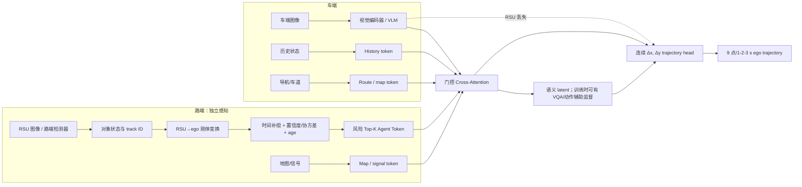

# V2X-VLM 模型优化与实验计划

> 创建日期：2026-09-28  
> 依据：[deep-research-report (6).md](deep-research-report%20(6).md)、当前 DrivewithVLM/E2 结果、[OmniV2X-main](/home/zzn/V2X_VLM/OmniV2X-main) 与 [UniMM-V2X-main](/home/zzn/V2X_VLM/UniMM-V2X-main) 本地代码。  
> 术语说明：下文将“drix-v2x”按当前项目实际数据理解为 **DAIR-V2X / V2X-Seq-SPD（V2X-Seq-SPD-New）**。工作区没有发现独立名为 DRIX-V2X 的数据根目录；若指的是另一数据集，不能直接复用本计划中的 split 与指标。

## 一、模型优化思路与实施步骤

### 1. 研究目标与边界

目标不是再做一个“车端图像 + 路端图像拼接后让 VLM 输出文字轨迹”的系统，而是构建一个：

> **能在车端坐标系中理解时延和不确定性的路端 Agent Tokens，与车端视觉/历史/地图信息融合，并由连续轨迹头输出未来位移的 V2X-VLM planner。**

这条路线与现有方法的区分如下。

| 方法 | 已有能力 | 本项目不能重复宣称的点 | 本项目应明确补上的点 |
|---|---|---|---|
| UniMM-V2X | 车路 Track/Map/Occ/Motion Query 多层协同、BEV/MoE 规划 | “共享查询”本身 | VLM 语义接口、显式物理消息字段、时延/置信度/风险机制 |
| OmniV2X | RSU 结构化对象/MAP token、连续 displacement/flow planner、低带宽 | “结构化 object token + 连续规划”本身 | 与 VLM semantic latent 的双流融合；面向检测误差/时延的 uncertainty-aware token |
| AURORA / DH-VLM（相关工作） | ego-frame query 对齐、VLM semantic token 或 latent communication | “query 转 VLM token”或“发送 latent”本身 | 几何保真、可解释消息年龄与置信度、可控风险/带宽以及 ego-only 退化机制 |
| 当前 DrivewithVLM | 车端/路端视觉、文字动作、轨迹输出、E2 physics 标签 | 直接把绝对坐标文本当作精确规划器 | 连续回归、物理对象 token、统一评测协议 |

### 2. 推荐的最终模型：先小后大

不要一次接入 detection、lane、VLM、flow、CoT、memory 和通信优化。推荐的最终模型由五个独立模块组成，任意模块失效时都可单独消融。

#### 2.1 Agent Token 合同（核心创新承载点）

每个路端对象在**车端 LiDAR/ego 坐标系**中编码为一个可追溯的 token，而不是重新 rasterize 成图片后再让 VLM 反推几何。建议字段：

| 字段组 | 推荐字段 | 作用 |
|---|---|---|
| 几何 | `x,y,z,l,w,h,yaw,vx,vy` | 保留精确、可度量的物理状态；由 RSU 坐标先变到 ego 坐标 |
| 观测质量 | class、score、可选 covariance / box uncertainty | 让模型学习何时降低路端消息权重 |
| 时序 | track ID embedding、message age、timestamp、`Δt` 补偿后的状态 | 对抗异步和 100–500 ms 延迟 |
| 来源 | RSU ID、source embedding、是否 RSU-only/双方可见 | 支持多路端与分析协同价值 |
| 规划风险 | TTC、相对速度、与预测 route 的距离/冲突、遮挡标记 | 用于 Top-K 选择，不把“置信度最高”误当成“最关键” |
| 语义（可选） | 轻量对象视觉/检测 query feature，经投影到 token dim | 补充类别、交互意图和场景语义；不能替代几何字段 |

第一版应以 **GT/官方检测状态作为 oracle token** 做上界验证；第二版替换为 D1/D2/D3 的 detector 输出；第三版才引入 detection query semantic feature。这样可以明确区分“规划器不好”与“检测器误差传入”。

#### 2.2 轨迹输出与 VLM 的职责

E2 已证明文字动作可评测，但它不适合作为最终毫米/米级坐标解码接口。推荐：

- **主输出：** `B × 9 × 2` 连续的 ego-frame displacement / waypoint head；先用确定性 MLP，稳定后再比较 Rectified Flow。
- **辅助输出：** lateral/longitudinal action，训练时作语义约束；不要让其取代连续规划损失。
- **VLM：** 生成或提供 latent semantic representation，训练时可使用 VQA、风险说明或动作文字的辅助损失；部署时不需要逐 token CoT 才能输出轨迹。
- **损失：** masked trajectory L1/L2 + final-step loss + collision loss + smoothness/acceleration regularization + 小权重 action/semantic loss。所有 future 缺失必须 mask，绝不以 `(0,0)` 填充有效 GT。

这会让本项目从“VLM 用文本数坐标”转为“VLM 负责理解、连续 head 负责精确运动学”，也是最直接吸收 OmniV2X displacement 结论的方式。

### 3. 分阶段实施路线与准入条件

| 阶段 | 实施内容 | 产物 / 通过标准 | 不通过时的处理 |
|---|---|---|---|
| P0：冻结协议 | 完成 E2 test；冻结 DAIR 版本、scene split、ego 坐标、1/2/3 s 采样、GT mask、碰撞检查器；保留 4.5 s 为扩展分析 | `dataset_manifest.json`、坐标单测、同一 evaluator；所有模型均能输出同格式 prediction | 不进入新模型，先修数据或评测 |
| P1：连续 ego-only planner | 在当前 V2 physics 基线上新增连续 `Δx,Δy` head；VLM 先可冻结/LoRA；保留 action 辅助任务 | 相对 E2 文本轨迹有不退化的 val L2、100% coverage、无格式解析失败 | 先简化到 history + continuous head，定位是 VLM 特征还是 decoder 问题 |
| P2：地图/路线 | 接入可部署的 route 输入及预测 lane/drivable feature；训练可用 lane GT 监督，推理不能泄露 GT | turn/signal subset 明确改善；route 来源在 train/val/test 都可获得 | 暂只保留 map token，不把 future-GT command 当输入 |
| P3：检测与物理 Agent Token | E5 单端 detector smoke → D1/D2 → D3 query fusion；先造 oracle RSU token，再接 detector token | RSU→ego 变换数值/可视化闭环；oracle token 对 ego-only 有协同增益 | 若 oracle 无收益，不应投入 detector/VLM semantic 融合 |
| P4：双流融合 | geometry token encoder + semantic/query projection，经 gated cross-attention 注入 VLM/trajectory head | geometry-only、semantic-only、dual-token 三者可比较；dual 不牺牲 clean L2 而改善关键场景安全 | 退回 geometry-only；语义只保留辅助 loss |
| P5：鲁棒通信 | 加 token age、置信度、velocity compensation、risk Top-K、RSU dropout；2–4 帧 memory 是后续项 | delay/dropout/noise 下的退化曲线优于无补偿模型；0% RSU 时不劣于 ego-only | 先固定 Top-K=16、只做 dropout；不要同时引入学习式 selector |
| P6：可选生成与闭环 | continuous MLP 与 flow 对照；先跑 PDMS，必要时迁移 V2XBench 做真实交互闭环 | 见本文第 6 节的可行性判据 | 不影响主论文的 DAIR 开环结论 |

#### P3 的实现决策：D1/D2 保留，D3 不再作为主模型前置条件（2026-09-28）

当前 UniV2X 中的 D1/D2 仍有价值，但其定位是**兼容性与接口基线**，不是要与 UniMM 争夺“最强 3D 检测器”：它们已经验证了 SPD 的单端 3D GT、车路坐标、时序打包和训练 loss 链路，并可作为日后 detector-token 替换时的最小可控路端输出源。D2 的 5 帧在 48 GB 上 OOM、单帧 smoke 已通过；后续先寻找 D1/D2 的共同可行时序长度（优先 3 帧），不要未经吞吐/检测指标验证就开 40 epoch。

本地代码对照显示 UniMM-V2X 的 stage-1 仍使用 `BEVFormerTrackHead`，而非一个可直接移植的全新检测 head；相对当前 UniV2X，主要是 1,500（而非 900）queries、MoE BEV 特征、TrackFormer 冻结/两阶段训练，以及 Track/Map/Occ/Motion 的联合协同。因此：

- **UniMM-V2X：** 作为 C3 强 query/BEV 协同 baseline；先用官方 stage-1/2 训练流程做单 batch 和统一 evaluator 验证，不能只替换一个 head 或直接声称更强。
- **D1/D2：** 完成统一时序 smoke、最小 detection/track 评测和“RSU 输出 → ego geometry token”导出即可；只有当其输出确实是最终 detector-token 来源时，才投入完整单端训练。
- **D3：** UniV2X 内的“直接 query/BEV 融合”应作为 UniMM 类 baseline 的诊断项，不再阻塞 Proposed 主线。Proposed 应先做 oracle RSU geometry token → VLM/continuous planner；若 oracle 有收益，再比较 D2 token、UniMM token 与 query semantic feature。这样可分离规划融合创新与检测器能力，且不重复 UniMM 的主贡献。

### 4. 近期唯一推荐的开发顺序

1. 结束 E2 test，锁定 `checkpoint-932` 的 test diagnostics；不要一边更改数据一边比较新 head。
2. 完成 E3/E4：route/lane 的可部署输入 + continuous trajectory head。此时得到强 **ego-only continuous** 对照。
3. 先完成 E5 detection 的单端/协同监督正确性，但不立即让 detector 与 planner 端到端耦合。
4. 构建 RSU→ego 的 **oracle geometry token**，只训练 token fusion + continuous planner。这是最关键的低风险验证。
5. 通过后，替换为冻结 detector token；再解冻小投影层/LoRA，不要同时大规模更新 detector 和 VLM。
6. 最后才增加 semantic feature、地图 token、风险选择、时延/噪声、memory 和 flow。

### 5. OmniV2X 与 UniMM-V2X：基线选择结论

选择 **两者都保留**，但不要把它们当成可直接复制数字的同一类基线。

| 基线 | 是否作为论文主基线 | 原因 | 本地代码确认 | 公平比较前必须做的工作 |
|---|---|---|---|---|
| **OmniV2X** | **是，优先复现** | 最强的 structured message/token + continuous flow planner 参照；公开 DAIR checkpoint、inference 与 PDMS 脚本齐全 | `scripts/infer_dairv2x.sh` 支持 DAIR cooperative inference；`scripts/eval_dairv2x_pdms.sh` 与 `docs/CHECKPOINTS.md` 提供 no-map/map checkpoint 合同 | 先检查其 DAIR loader 的 split、2,390 val 样本、9 future frames/间隔与本项目一致；若不一致，公开复现表和“统一协议重评表”必须分开 |
| **UniMM-V2X** | **是，作为 query/BEV 协同基线** | 与 UniV2X 同数据家族，真正对比“BEV/query 多层协同”与本项目 token/VLM 融合 | 官方 repo 含 SPD converter、vehicle/infra/cooperative 两阶段训练；coop stage-2 有 planning head 与 collision loss | 需要重训/适配，成本高；其默认 planner 取 6 future steps，必须导出并重采样/统一到 1/2/3 s evaluator |
| **UniV2X** | 否（诊断参考） | UniMM 已是其加强版；额外做成主表会稀释工作量 | 本工作区已用于 E5 detector/query 审计 | 只在必要时报告复现诊断或引用官方结果，不设第四主基线 |
| **V2X-VLM-style** | 是（内部直接 VLM 对照） | 回答“额外 RSU 图像/文字是否已经足够”，也是本项目最公平的同 backbone 对照 | 当前 DrivewithVLM 已有 LLaVA interleave、车端/路端视觉与 E2 流程 | 明确写为 *reimplementation/style baseline*，不能声称官方精确复现 |

**主表最小组合：** ego-only continuous、V2X-VLM-style、UniMM-V2X、OmniV2X no-map、OmniV2X + MAP、Proposed。若资源不足，优先保证 ego-only / V2X-VLM-style / OmniV2X / Proposed；UniMM 的训练可以排在后面，但其缺失必须在论文中透明说明。

### 6. 闭环是否值得做、是否好复现

| 选择 | 可行性 | 价值 | 建议 |
|---|---|---|---|
| **OmniV2X DAIR PDMS** | 中等偏高 | 可把已保存的 trajectory prediction 转为 PDMS/安全代理分数；本地已有 `eval_dairv2x_pdms.sh` | **推荐的第一步**。它是 predictive/kinematic closed-loop proxy，不应写成真实交互闭环 |
| **V2XBench / CARLA 真闭环** | 中等偏低 | 能报告 route completion、driving score、交互碰撞；回答 open-loop L2 是否真的更安全 | 仅在 DAIR 主实验、鲁棒性和 PDMS 全部完成后做；需要重新接入 simulator 数据和控制接口 |
| **复现 AURORA 真闭环** | 低 | 方法最接近，但调研中未找到可直接复现实装 | 不作为交付承诺；只能参考其指标与任务设计 |
| **V2Xverse / CoDriving** | 中等偏低 | 有协同闭环场景，但迁移现有 VLM/token 模型成本大 | 若已有环境可用再考虑；不优于先做 V2XBench 的研究价值 |

结论：**闭环是很好的加分项，不是主线验收项。** 先使用 OmniV2X 的 PDMS 脚本建立一个统一安全代理评测；只有当 Proposed 在开环、通信鲁棒性与 PDMS 上都有稳定收益时，才投入 V2XBench/CARLA 真闭环。这样不会因为 simulator 迁移拖垮 DAIR 主实验。

---

## 二、实验设计与结果表格

### 1. 全部实验的共同协议（必须先填写）

| 项目 | 固定值 / 要求 | 本项目当前状态 |
|---|---|---|
| 主数据集 | DAIR-V2X-Seq / V2X-Seq-SPD-New；scene-disjoint train/val/test | 当前 E2 使用 `data/Planning/v2_physics/`；外部基线须对齐或单列 |
| 主时域 | 1 s / 2 s / 3 s；4.5 s 仅作扩展 | 当前 E2 为 0.5 s × 9 点，需从同一预测取 1/2/3 s |
| 坐标 | vehicle LiDAR / ego frame，X 前、Y 左 | 已有 E5 D0 闭环审计；所有 baseline 导出必须统一 |
| 主指标 | L2@1/2/3 s、final L2/FDE、collision rate | 统一 evaluator，禁止混用论文原始数值 |
| 工程指标 | bytes/s、端到端 latency、peak GPU memory、trainable params | 最终模型和 OmniV2X 必报 |
| 报告统计 | 主模型与关键 baseline ≥3 seed 或 bootstrap 95% CI | 资源不足时至少 Proposed 与 ego-only 做 CI |
| 子集 | straight/left/right、signal/non-signal、occluded、RSU-only-visible | 用同一 subset manifest，避免事后挑样本 |

### 2. 第一类：DAIR-V2X 论文/方法对比实验

#### 2.1 应执行的对比矩阵

| ID | 方法 | 输入与通信 | 角色 | 训练/复现策略 | 必报指标 |
|---|---|---|---|---|---|
| C0 | Ego-only continuous | 车端图像 + history + route；无 RSU | 协同增益下界 | 由 P1 实现 | 全部主指标；作为 RSU dropout 的 0% 参照 |
| C1 | Current E2 physics | 车端/路端当前视觉 + 文本动作/trajectory | 现有系统基线 | 使用 test 最终 checkpoint-932 | 与 C0 同 evaluator；单列文字解析 coverage |
| C2 | V2X-VLM-style | 车端 + RSU 原始视觉/文本，保持 C0 同 VLM 与 continuous head | 直接 VLM 对照 | 在 RoboLLM 内实现；不是官方精确复现 | 协同增益、带宽代理、关键遮挡子集 |
| C3 | UniMM-V2X coop stage-2 | Track/Map/Occ/Motion query + BEV | query/BEV SOTA 对照 | 官方代码重训或适配 checkpoint；统一导出 evaluator | L2、collision、显存、训练预算 |
| C4 | OmniV2X no-map | ego images + 最多 16 RSU SDSM tokens | structured-token 强基线 | 先跑 released checkpoint；再做统一协议 adapter | 原仓复现表 + 统一协议表；BPS/latency/PDMS |
| C5 | OmniV2X + MAP | C4 + 128 map tokens | map-token 对照 | released map checkpoint | 同 C4；特别看 turn/signal/collision |
| C6 | Proposed-G | ego + oracle geometry Agent Tokens | 机制上界 | 只训练 fusion/planner | 验证 token 路线是否值得；不计 detector 误差 |
| C7 | Proposed-GS | ego + detector geometry + semantic Agent Tokens + map/route | 最终模型 | P4–P5 完成后 | 全部主指标、鲁棒性、BPS、latency、PDMS |

#### 2.2 论文结果总表模板

| Method | Train split / samples | L2@1s ↓ | L2@2s ↓ | L2@3s ↓ | Final L2 ↓ | 平均L2@1/2/3s ↓ | Collision ↓ | Off-road ↓ | BPS ↓ | Latency ms ↓ | Memory GB ↓ | PDMS ↑ | Notes |
|---|---:|---:|---:|---:|---:|---:|---:|---:|---:|---:|---:|---:|---|
| C0 Ego-only continuous |  |  |  |  |  | |  |  | 0 |  |  |  |  |
| C1 Current E2 physics |  |  |  |  |  | |  |  |  |  |  |  | text coverage separately |
| C2 V2X-VLM-style |  |  |  |  |  | |  |  |  |  |  |  |  |
| C3 UniMM-V2X |  |  |  |  |  | |  |  |  |  |  |  | official re-train/adapt |
| C4 OmniV2X no-map |  |  |  |  |  | |  |  |  |  |  |  | released vs unified protocol |
| C5 OmniV2X + MAP |  |  |  |  |  | |  |  |  |  |  |  | released vs unified protocol |
| C6 Proposed-G oracle |  |  |  |  |  | |  |  |  |  |  |  | upper-bound token input |
| C7 Proposed-GS |  |  |  |  |  | |  |  |  |  |  |  | final |
| T1 双端GT对象文本 | native train / 929 | 0.1099 | 0.5764 | 1.5095 | 3.8247 | 0.7319 | — | — | — | — | 21.45 | — | test480；epoch5；coverage480/480；seed42；state/history文本 |
| I1 / S1 双端GT对象soft tokens | native train / 929 | 0.1030 | 0.5642 | 1.4802 | 3.7948 | 0.7158 | — | — | — | — | 17.27 | — | test480；epoch6；coverage480/480；seed42；state/history文本 |
| I2 视觉 / 空间queries | 待训练 | — | — | — | — | — | — | — | — | — | — | — | 待实现；保留P，同对象/状态合同；额外预训练披露 |
| I3 跨源空间融合queries | 待训练 | — | — | — | — | — | — | — | — | — | — | — | 待实现；保留P；与I2固定carrier对照 |

> 不允许把 OmniV2X/UniMM 论文报告的平均 L2 直接填入本表；只有重新以相同 split、horizon、GT 和 collision checker 得出的数值才可横向比较。论文原始复现数值另做附表。

2026-10-05填写说明：本表新增T1与I1/S1两行，C0–C7原计划模型行保留，不能将当前Oracle＋语言LoRA配方直接冒充原C6/C7。当前已测两行使用同一`dual_object_a1_v1_20261004`缓存（929train/157val/480test），独立双端原生GT、因果补偿、A1关联、50m ROI，均6epoch/1398更新，val选epoch，test生成9步、0.5–4.5s轨迹；两组评测输入guard统一8192，不截断。

- **Final L2明确指4.5s终点L2（FDE@4.5s），不是全9步平均，也不是三时域平均**；新增平均L2列为(L2@1s＋L2@2s＋L2@3s)/3，单位m。原C0–C7填值时须采用相同定义与horizon。
- Memory单位为十进制GB，记录四rank中最大`torch.cuda.max_memory_allocated`（T1=21,454,255,616bytes；S1=17,272,263,168bytes），不是nvidia-smi总占用或reserved memory；后续统一测量方式。
- Latency尚未测量单样本端到端时延，留“—”。四卡生成阶段整批480帧耗时T1=1692.68s、S1=1550.50s（约28.2/25.8分钟），不含模型加载，不能直接填入Latency列。
- Collision、Off-road、PDMS无相应评测器；BPS无传输协议和字节计量，均未评测，不能用输入tokens或对象数代替。空白旧行/“—”均表示无可比较实测值，C0 BPS=0仅为无RSU通信设定。
- 单seed42；S1 test主平均降低2.20%，不能称显著或稳定优势，不能由两组都有RSU的对照推断协同增益。validation结果另见实施记录，不混填test表。

证据：[test总报告](../evaluation_results/T1_S1_test_20261005_114004/report.md)、[comparison.json](../evaluation_results/T1_S1_test_20261005_114004/comparison.json)、[逐帧分析](../evaluation_results/T1_S1_test_20261005_114004/paired_analysis.json)。对应技术与实验定义见[融合方案3.1.1](roadside_agent_token_fusion_plan.md#311-实验方案与首轮结果2026-10-05)。

**长时域baseline对照（2026-10-05）：**采用用户提供的2.5/3.5/4.5s表头。V2X-VLM行是用户提供的参考值，尚未核实来源、split、样本数、输入、GT与collision checker；T1/S1行来自本次480帧test逐帧预测重算。当前仅并列展示，不视为统一协议下的公平排名。原论文/外部报告结果与本项目实测来源明确区分。

| Method / Settings | L2 Error (m) ↓ 2.5s | L2 Error (m) ↓ 3.5s | L2 Error (m) ↓ 4.5s | L2 Error (m) ↓ Avg. | Collision Rate (%) ↓ 2.5s | Collision Rate (%) ↓ 3.5s | Collision Rate (%) ↓ 4.5s | Collision Rate (%) ↓ Avg. |
|---|---:|---:|---:|---:|---:|---:|---:|---:|
| V2X-VLM (Baseline；用户提供，协议待核实) | 1.09 | 1.12 | 1.42 | 1.21 | 0.02 | 0.03 | 0.03 | 0.03 |
| T1 双端GT对象文本；本项目test480 | 0.9740 | 2.1524 | 3.8247 | 2.3170 | — | — | — | — |
| I1 / S1 双端GT对象soft tokens；本项目test480 | 0.9564 | 2.1246 | 3.7948 | 2.2920 | — | — | — | — |
| I2 视觉 / 空间queries；待实验 | — | — | — | — | — | — | — | — |
| I3 跨源空间融合queries；待实验 | — | — | — | — | — | — | — | — |

此表Avg.为三个终点时刻L2的算术平均，**不是0.5–4.5s全部九点平均，也不是此前1/2/3s平均**。Baseline按用户给值保留（可能存在四舍五入），碰撞字段单位为百分比；本项目碰撞未评测，不能填0或移用baseline值。T1/S1在本次协议下的长时域平均分别2.3170/2.2920m，S1降低约1.08%；2.5s低于所给baseline，3.5/4.5s高于所给baseline，但协议未统一，不能由此下公平胜负结论。

补充4s指标：T1 L2@4s=2.9286m，S1=2.9043m。数据证据：[长时域指标](../evaluation_results/T1_S1_test_20261005_114004/long_horizon_metrics.json)。无需重新推理，使用相同480帧预测与原始GT，索引4/6/8分别对应2.5/3.5/4.5s，索引7对应4s。

### 3. 第二类：消融实验

消融以 C7 为参照，采用“每次只改一个机制”的顺序；不要全排列。

| ID | 从参照模型移除/替换的部分 | 回答的问题 | 优先级 | 预期观察 |
|---|---|---|---|---|
| A0 | C0 ego-only | 协同的绝对收益是什么？ | 必做 | C7 相对 C0 的 L2/collision 增益 |
| A1 | raw RSU image 替代 Agent Token | 另一个图像是否已足够？ | 必做 | 与 C2 的公平 VLM 对照 |
| A2 | geometry-only token | 精确物理状态本身有多少贡献？ | 必做 | 至少改善遮挡/交叉口 |
| A3 | semantic-only token | 语义能否替代几何？ | 建议 | 可能动作理解好、L2 较差 |
| A4 | geometry + semantic dual token | 双流是否互补？ | 必做 | collision 降而 clean L2 不退化 |
| A5 | RSU 坐标不做显式 ego transform | 坐标对齐是否必要？ | 必做（只用于诊断） | 明显退化，证明变换价值 |
| A6 | 无时间补偿 / 无 age embedding | 时延信息是否有效？ | 必做 | 在延迟注入时改善最明显 |
| A7 | confidence/uncertainty embedding 去除 | 模型是否会学会不盲信 RSU？ | 建议 | 噪声/误检下更稳 |
| A8 | random/confidence Top-K 替代 TTC/route-risk Top-K | 风险选择是否优于普通压缩？ | 必做 | 同 BPS 下 collision 更低 |
| A9 | K = 4/8/16/32/all | 最少需要多少通信？ | 必做 | L2/collision–BPS Pareto 曲线 |
| A10 | 无 map/signal token | 地图信息真实贡献？ | 建议 | turn/signal 子集收益 |
| A11 | 无 VQA/action semantic auxiliary loss | VLM 语义监督是否改善规划？ | 建议 | 长尾/安全改善可能大于平均 L2 |
| A12 | absolute XY text vs continuous ΔXY head | 输出表示是否是主要瓶颈？ | 必做 | invalid output 归零、L2/FDE 降低 |
| A13 | no RSU dropout | 是否具备 ego-only fallback？ | 必做 | 0% RSU 时不弱于 C0 |
| A14 | 1-frame vs 2/4-frame memory | temporal Agent Memory 是否必要？ | 有时间再做 | turn/intersection 受益 |
| A15 | flow 替代 MLP continuous head | 多模态生成是否值得额外复杂度？ | 有时间再做 | 需同时看 latency 与 safety |

#### 3.1 消融结果表模板

| ID | Variant | L2@1s ↓ | L2@2s ↓ | L2@3s ↓ | Collision ↓ | BPS ↓ | Latency ms ↓ | Occluded L2 ↓ | RSU-only-visible L2 ↓ | Δ vs C7 | 结论 |
|---|---|---:|---:|---:|---:|---:|---:|---:|---:|---:|---|
| C7 | Full proposed |  |  |  |  |  |  |  |  | – |  |
| A2 | Geometry only |  |  |  |  |  |  |  |  |  |  |
| A3 | Semantic only |  |  |  |  |  |  |  |  |  |  |
| A4 | Dual token |  |  |  |  |  |  |  |  |  |  |
| A6 | –time/age |  |  |  |  |  |  |  |  |  |  |
| A7 | –uncertainty |  |  |  |  |  |  |  |  |  |  |
| A8 | random Top-K |  |  |  |  |  |  |  |  |  |  |
| A9 | K=4/8/16/32/all |  |  |  |  |  |  |  |  |  | Pareto figure |
| A10 | –map/signal |  |  |  |  |  |  |  |  |  |  |
| A11 | –semantic loss |  |  |  |  |  |  |  |  |  |  |
| A12 | absolute-text / delta-head |  |  |  |  |  |  |  |  |  |  |
| A13 | –RSU dropout training |  |  |  |  |  |  |  |  |  |  |

### 4. 第三类：VLM backbone 与数据集比较

该类别的目标不是随意换一个大模型刷分，而是验证：结论是否依赖某一 VLM，Agent Token 接口能否跨 backbone/数据成立。必须固定 token、continuous head、训练 epoch、LoRA rank、图像尺寸、数据 split 和 evaluator。

#### 4.1 VLM backbone 表

| ID | Backbone | 本地可用性 | 建议角色 | 实施前置条件 |
|---|---|---|---|---|
| V0 | LLaVA-Next-Interleave（当前 E2） | 已在 `checkpoints/LLM/llava-next-interleave` 与现有 config 中使用 | **主 backbone** | 先完成 C0–C7 |
| V1 | LLaVA-Interleave-Qwen-7B | 本地存在 `checkpoints/ALL/llava-interleave-qwen-7b`，并有对应 loader/collator | 同家族规模/接口对照 | 统一 image token、LoRA、token fusion adapter |
| V2 | Qwen2-VL-7B | 项目有 `qwen2-vl` loader/collator 支持；权重/配置需单独核验 | 跨 VLM 家族对照 | 先做单 batch 与同输出 head 的 smoke；不要直接使用 Qwen2.5 路径而不验证 processor/model contract |
| V3 | 轻量 0.5B interleave | 本地记录有 0.5B LoRA 目录 | 部署/latency 下界，不是主精度结论 | 只在 V0/V1 完成后做 |

#### 4.2 数据集与闭环环境表

| ID | 数据/环境 | 任务定位 | 是否可直接作为 planner 主表 | 建议实验 |
|---|---|---|---|---|
| D0 | DAIR-V2X-Seq / V2X-Seq-SPD-New | 主训练、主测试、主 baseline 比较 | **是** | 所有 C/A/V 实验 |
| D1 | V2X-QA（同数据家族） | 语义/VQA 辅助监督和跨视角理解评测 | 否 | A11：有/无 semantic auxiliary loss；报告 QA 与规划联合结果 |
| D2 | TUMTraf-V2X / UrbanIng-V2X | Agent Token 前端与域外感知泛化 | 否，除非有可靠 ego future trajectory GT 与 map/evaluator | 不重训 planner；评估 RSU→ego token transform、检测/track、noise robustness |
| D3 | OmniV2X DAIR PDMS | predictive/kinematic 安全代理评测 | 作为附加安全表 | C4/C5/C7 统一 trajectory adapter |
| D4 | V2XBench / CARLA | 真正交互闭环 | 否，作为可选加分实验 | 最终模型与 C0/C2 的 driving score、route completion、collision |

#### 4.3 Backbone / dataset 结果表模板

| Group | Variant | Train data | Test data | L2@3s ↓ | Collision ↓ | BPS ↓ | Latency ms ↓ | Params (trainable/total) | QA / DS / PDMS ↑ | 结论 |
|---|---|---|---|---:|---:|---:|---:|---|---:|---|
| VLM | V0 LLaVA-Next Interleave | DAIR | DAIR |  |  |  |  |  |  |  |
| VLM | V1 LLaVA-Interleave-Qwen-7B | DAIR | DAIR |  |  |  |  |  |  |  |
| VLM | V2 Qwen2-VL-7B | DAIR | DAIR |  |  |  |  |  |  |  |
| VLM | V3 light model | DAIR | DAIR |  |  |  |  |  |  |  |
| Data | D1 + V2X-QA auxiliary | DAIR + V2X-QA | DAIR |  |  |  |  |  | QA= |  |
| Robustness | D0 normal / delay / dropout / pose noise | DAIR | DAIR |  |  |  |  |  |  | separate rows per level |
| Closed-loop proxy | D3 PDMS | DAIR | DAIR |  |  |  |  |  | PDMS= | not true interactive loop |
| Closed-loop optional | D4 V2XBench | V2XBench | V2XBench |  |  |  |  |  | DS/RC= | separate domain |

### 5. 鲁棒性子表（最终模型至少必做）

| Stress | Level | C0 ego-only | C7 full | A6 no time compensation | A7 no uncertainty | 指标与判据 |
|---|---:|---:|---:|---:|---:|---|
| Message latency | 0 / 100 / 300 / 500 ms |  |  |  |  | L2@3s、collision；C7 在 300 ms 后仍有协同收益 |
| RSU object dropout | 0 / 10 / 30 / 50% |  |  |  |  | 性能退化斜率 |
| RSU availability | 100 / 70 / 30 / 0% |  |  |  |  | 0% 时 C7 不应差于 C0 |
| Translation noise | 0 / 0.1 / 0.5 / 1.0 m |  |  |  |  | 坐标鲁棒性 |
| Yaw noise | 0 / .01 / .05 / .1 rad |  |  |  |  | 转弯/交叉口子集 |
| Box position noise | 0 / .2 / .5 / 1.0 m |  |  |  |  | detector 误差敏感性 |
| Token budget | 4 / 8 / 16 / 32 / all | – |  | – | – | L2/collision–BPS Pareto |

### 6. 论文中应避免的无效对比

1. 不把 E2 的 4.5 s、480 样本 test 与 OmniV2X/UniMM 的论文 1/2/3 s 数字直接排序。
2. 不将 OmniV2X 的 released checkpoint 结果与本模型新 split 的结果放在同一主表，除非完成 dataset adapter 和统一 evaluator。
3. 不用 GT lane、未来 GT command 或 future object state 作为测试输入；这些只能是训练监督或明确标记的 oracle 上界。
4. 不只报告 mean L2；至少同时报告 collision、BPS、latency，以及 occlusion/turn/signal 子集。
5. 不用单一 seed 的 0.01–0.05 m 差异声称 SOTA；关键结论应给多 seed 或 bootstrap CI。

### 7. 近期里程碑

| 顺序 | 下一件事 | 结果决定 |
|---:|---|---|
| 1 | 完成 E2 checkpoint-932 test，保存 diagnostics | 冻结当前 VLM 文本基线 |
| 2 | 统一 1/2/3 s evaluator，并用当前 E2/C0 验证 | 后续表格是否可横比 |
| 3 | 复现 OmniV2X released no-map/map checkpoint | 确定其 loader/split 与本数据的适配成本 |
| 4 | 完成 E4 continuous ego-only head | 确定连续输出是否取代文字坐标 |
| 5 | oracle Agent Token 消融（C6） | 决定 E5 detector-to-planner 是否值得投入 |
| 6 | D1/D2/D3 detector 与 Proposed-GS | 得到真正协同模型 |
| 7 | UniMM-V2X 重训/适配与完整消融 | 形成论文主表 |
| 8 | PDMS；如资源充足再 V2XBench 闭环 | 安全性加分证据 |
